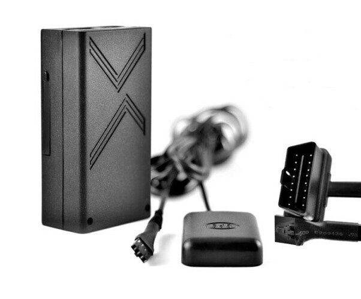

# TK-Star - LK200B

The TK-Star LK200B GPS Vehicle Tracker is a compact and versatile device built to monitor vehicles in real time. Designed for use on private cars, rental vehicles, and business fleets, it provides continuous location visibility and route history that help users keep track of vehicle movements. Key features called out by the manufacturer include real time tracking, auto tracking intervals, blind area tracking for low signal coverage, and history trace checking for reviewing past routes.

As a Plaspy compatible device, the LK200B can feed location and event data into the Plaspy fleet management platform to give operators centralized visibility and control. Integration with Plaspy enables teams to view live positions, receive alerts, and review trip history alongside other assets managed on the platform. For organizations evaluating trackers for use with Plaspy, the LK200B represents a practical option where reliable location reporting and common vehicle alerts are required.

## Key Highlights

- Real time vehicle tracking for live position visibility
- Auto tracking with configurable update intervals for route continuity
- Blind area tracking designed to capture movement in low signal areas
- History trace checking to review past routes and locations
- Built in geofence alerts to notify on entry and exit of defined areas
- Multiple alert types including movement alert, overspeed alert, low battery alert, OBD data detection, and shaking sensor alert

## How It Works with Plaspy

When used with Plaspy, the LK200B supplies position and event information to the Plaspy platform so fleets and vehicle owners can monitor assets from a single interface. Plaspy consolidates incoming data from compatible trackers like the LK200B and presents it in dashboards, maps, and reports for operational oversight.

- Live location mapping in Plaspy to monitor current vehicle positions
- Alerts forwarded into Plaspy for geofence events, overspeed, movement, and low battery
- Historical route playback and trace review within Plaspy reporting tools
- Fleet level visibility for groups of LK200B devices alongside other compatible trackers
- Use of Plaspy dashboards for status monitoring and high level operational reporting

## Typical Use Cases

- Monitoring private cars for security and location awareness
- Tracking rental vehicles to verify usage and location history
- Managing company fleets for route oversight and operational coordination
- Enforcing perimeter controls with geofence alerts for sensitive sites
- Reviewing trips and overspeed events for driver oversight and compliance

## Why Choose This Tracker with Plaspy

The LK200B is a practical choice for organizations that need dependable location reporting and a common set of vehicle alerts. Its focus on core tracking functions and historical trace makes it suited to both single vehicle monitoring and scaled fleet deployments when paired with a management platform like Plaspy. Using the LK200B with Plaspy lets operators combine device reports with Plaspy's visualization and reporting to maintain situational awareness and support operational decisions.

To learn more about how Plaspy can manage compatible devices including the LK200B, visit https://www.plaspy.com. Product specifications, availability, and manufacturer details can change over time, so verify current technical and support information with the manufacturer at https://www.tk-star.com/.
