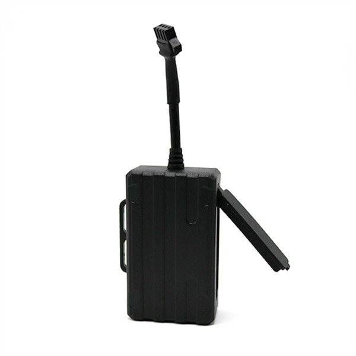

# TK-Star - TK210

The TK210 is a compact 4G Android motorcycle GPS tracker designed for motorcycles, electric vehicles, scooters, private cars and vehicle rental fleets. Plaspy compatible by design, the TK210 brings dependable real-time tracking and rich telemetry to vehicle protection and fleet management workflows, combining multi-constellation GNSS, cellular 4G connectivity and indoor positioning \(LBS, Wi‑Fi\) for reliable location indoors and out.

Built for anti-theft protection and operational visibility, the TK210 includes a sensitive built-in vibration sensor, geo-fence alerts, movement and overspeed notifications, and a remote engine cut-off \(oil supply\) feature. When paired with Plaspy, fleet managers and vehicle owners get actionable location intelligence, event alerts and route history to reduce loss, speed up recovery and simplify everyday fleet operations.

## Key Highlights

- Plaspy compatible 4G GPS tracker for real-time tracking of motorcycles, scooters, EVs and rental vehicles.
- Multi-constellation positioning \(GPS/GLONASS/BeiDou\) plus LBS and Wi‑Fi for better indoor/outdoor coverage.
- Instant movement and overspeed alerts plus built-in vibration sensor for proactive anti-theft protection.
- Remote engine cut-off \(oil supply\) — immobilizer capability to stop and resume a vehicle remotely.
- Retains historical route data on the server for up to six months, viewable through web and mobile apps.
- Wide voltage range \(9–75 V\) and compact form factor for flexible installation across vehicle types.
- Rugged operating temperature and electrostatic protection suited for mobile deployments.

## How It Works with Plaspy

When integrated with Plaspy, the TK210 transmits location and event data over 4G to Plaspy’s platform for real-time tracking, alerts and reporting. Plaspy ingests GNSS positions, cellular-assisted location and onboard alerts to create unified telemetry, trigger notifications and store historical routes for compliance and analysis. Integration supports both live monitoring and retrospective review so teams can act quickly on anti-theft events and optimize fleet utilization.

- Real-time location and telemetry updates delivered to Plaspy for live maps and dashboards.
- Movement, vibration and overspeed alerts forwarded to Plaspy for instant notifications and workflow automation.
- Geo-fence events \(enter/exit\) sent to Plaspy to automate perimeter alerts and rental zone enforcement.
- Remote engine cut-off \(immobilizer\) control via Plaspy-enabled commands to stop and resume vehicle operation when authorized.
- Historical route data retained on the server \(up to six months\) and accessible in Plaspy for auditing and reporting.

## Technical Overview

| Connectivity | FDD-LTE, TDD-LTE, WCDMA, GSM \(4G/3G/2G multi-mode\) |
| --- | --- |
| Bands | FDD-LTE: B1/B2/B3/B4/B5/B7/B8/B12\(17\)/B20/B28; TDD-LTE: B38/B39/B40/B41; WCDMA: B1/B2/B5/B8; GSM: 850/900/1800/1900 |
| Power & Battery | Operating voltage 9–75 V; internal rechargeable 3.7 V, 370 mAh Li‑ion battery \(≈1 day standby, configuration-dependent\) |
| Interfaces | Built-in vibration sensor; geo-fence and alert reporting; remote engine cut-off \(oil supply\) / immobilizer feature |
| GNSS | Chipset SC9820E; GPS/GLONASS/BeiDou support; 66 channels; sensitivity -165 dBm; typical accuracy ~10 m; TTFF cold 35–80 s, warm ~35 s, hot ~1 s |
| Bluetooth | Not specified |
| Remote Management | Manufacturer web platform and mobile app; historical routes stored up to six months \(FOTA not specified\) |
| Form Factor & Environmental | Dimensions 75 × 52 × 22 mm; weight 168 g; operating temperature -20 °C to +55 °C; storage -40 °C to +85 °C; humidity 5%–95% non‑condensing; electrostatic protection touch ±7 kV, non-touch ±14 kV |

## Use Cases

- Fleet management: monitor routes, reduce unauthorized use and maintain oversight of small vehicle fleets and rentals.
- Anti-theft protection: vibration-triggered alarms plus remote immobilizer reduce the risk of motorcycle and scooter theft.
- Rental vehicle security: geo-fence enforcement and historical route review simplify dispute resolution and contract compliance.
- Last-mile and mobility services: real-time tracking for scooters and electric bikes improves dispatching and utilization.
- Personal vehicle monitoring: owners get peace of mind with live location, movement alerts and remote engine cut-off functionality.

## Why Choose This Tracker with Plaspy

The TK210 is a practical, compact GPS tracker when you need reliable Plaspy compatible real-time tracking and basic telemetry without complex installation. Its multi-constellation GNSS and combined LBS/Wi‑Fi positioning improves coverage for urban and indoor scenarios, while the vibration sensor and remote immobilizer provide tangible anti-theft value. For fleet managers, the TK210 delivers the fundamentals of fleet management — live location, event alerts and retained route history — in a device sized for motorcycles, scooters, EVs and light vehicles.

Paired with Plaspy, the TK210 becomes part of a scalable tracking solution: centralized dashboards, automated alerts, and stored telemetry turn raw location data into operational insights. If you need extendable telemetry \(for example, fuel monitoring or additional sensor data\), Plaspy can combine TK210 position and event feeds with other data sources to create richer vehicle intelligence without replacing the tracker. Choose the TK210 with Plaspy for affordable, reliable vehicle security and straightforward fleet oversight.

