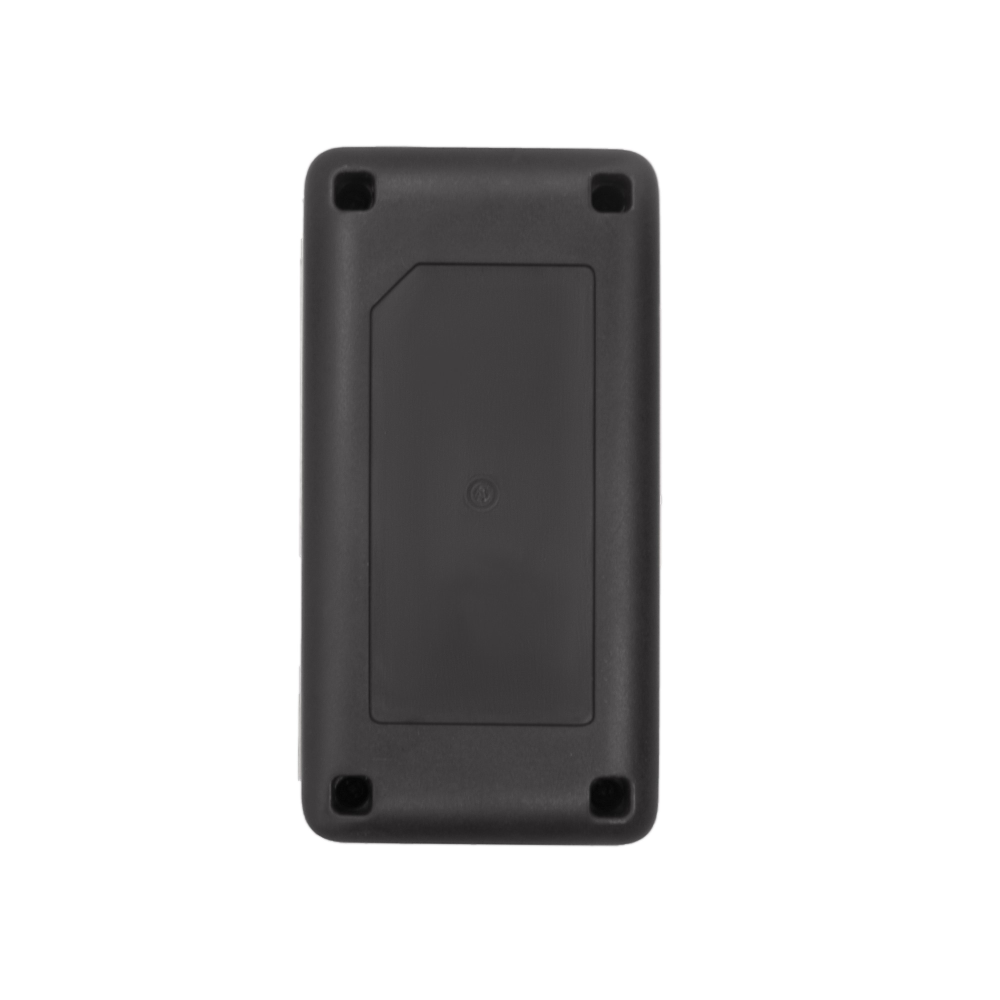

# TK-Star - TK820

The TK820 is a portable 4G GPS tracker engineered for flexible personal and asset tracking. Plaspy compatible out of the box, the TK820 delivers reliable real-time tracking, movement alerts, and server-backed route history across app and web platforms — making it a practical choice for protection of children, elderly family members, and valuable assets.

Designed for outdoor and indoor positioning, the TK820 combines GPS, BeiDou \(BD\), GLONASS, LBS and WiFi positioning to improve location accuracy in challenging environments. With IP65 water resistance, a long-life 3.7V 3000 mAh battery, and built-in vibration and SOS functionality, the TK820 balances durability and user safety for everyday fleet management and anti-theft applications when integrated with Plaspy.

## Key Highlights

- Plaspy compatible 4G GPS tracker for real-time tracking and telemetry across app and web dashboards.
- Multi-constellation positioning \(GPS/BeiDou/GLONASS\), plus LBS and WiFi, for improved indoor/outdoor accuracy.
- Built-in vibration sensor and movement alerts to support anti-theft monitoring and immediate notifications.
- SOS call button for emergency voice calls and quick alerts to caregivers or dispatchers.
- IP65 waterproof rating and rugged environmental tolerance for reliable outdoor operation.
- Long battery life: 3.7V 3000 mAh Li‑ion battery with up to 30 days standby under power-saving modes.
- Server storage of historical routes \(up to six months\) with playback on both app and web platforms.

## How It Works with Plaspy

When paired with Plaspy, the TK820 streams location and status updates so fleets and caregivers receive timely, actionable information. Plaspy ingests the device’s GNSS and auxiliary positioning data, translates movement and alert events into notifications, and stores historical telemetry for review and compliance reporting.

- Real-time location and telemetry updates: GNSS coordinates plus LBS/WiFi-assisted fixes feed Plaspy for continuous tracking.
- Movement & vibration alerts: built-in vibration sensor triggers instant notifications for suspected tampering or motion.
- SOS emergency calls: SOS button events generate priority alerts and allow immediate voice contact routing via Plaspy notifications.
- Geofence and over-speed alarms: geofence breaches and speed thresholds are reported in real time to Plaspy for automated alerts.
- Historical routes and playback: up to six months of server-stored route data is available in Plaspy for audit, route analysis, and playback.

## Technical Overview

| Connectivity | 4G \(FDD/TDD LTE\), WCDMA \(3G\), NB‑IoT / Cat‑M1, EGPRS \(2G\) for fallback |
| --- | --- |
| Bands | Multiple global FDD/TDD LTE and WCDMA bands \(regional variants supported\); NB‑IoT/Cat‑M1 and EGPRS bands for broad coverage |
| Power & Battery | Rechargeable 3.7V 3000 mAh Li‑ion battery; up to 30 days standby \(typical power‑saving modes\). Charging options: 12–24V car charger \(5V output\) and 110–220V wall charger \(5V output\). |
| Interfaces | Built-in SOS call button; built-in vibration sensor; charging inputs as specified \(car and wall chargers\) |
| GNSS | SC9820E chipset, 66 channels, -165 dBm sensitivity; typical GPS accuracy around 10 meters. TTFF: cold ~35–80 s, warm ~35 s, hot ~1 s. Supports GPS, BeiDou \(BD\) and GLONASS; also uses LBS and WiFi for assisted positioning. |
| Bluetooth | Not specified / no Bluetooth sensors listed in device description |
| Remote Management | Server-side historical route storage \(up to 6 months\) with app and web playback. FOTA/firmware update not specified. |
| Form Factor & Environmental | Approx. 78 × 39 × 29 mm; weight ≈ 144 g; IP65 waterproof rating. Operating temperature: -20°C to +55°C; storage: -40°C to +85°C; humidity tolerance 5%–95% non‑condensing. |

## Use Cases

- Child and elderly safety: real-time tracking and SOS call handling for quick response in emergencies.
- Portable asset protection: vibration-triggered alerts and geo-fence monitoring to deter theft and detect unauthorized movement.
- Small fleet oversight: location, over-speed warnings, and historical route playback for basic fleet management and driver behavior review.
- Special needs monitoring: discreet, waterproof tracking suitable for caregivers managing vulnerable individuals.
- Temporary or remote deployments: long battery standby and multi-network cellular support for reliable coverage in diverse regions.

## Why Choose This Tracker with Plaspy

Pairing the TK820 with Plaspy delivers a pragmatic balance of portability, robust positioning and event-driven alerts. For organizations and families that need dependable real-time tracking, the TK820’s multi-constellation GNSS support, LBS/WiFi augmentation, and vibration/SOS features provide clear telemetry to Plaspy’s dashboards and mobile notifications. The device’s long battery life, IP65 rating, and server-backed route history \(up to six months\) make it a reliable addition to Plaspy-compatible deployments.

While some fleet solutions also integrate fuel monitoring, ignition or immobilizer controls, and Bluetooth sensors, the TK820 focuses on comprehensive location and alerting capabilities. For customers requiring additional telemetry such as fuel or immobilizer control, Plaspy can consolidate TK820 location data with supplementary sensors or gateways supported by the platform to create a fuller fleet management or anti-theft solution.

