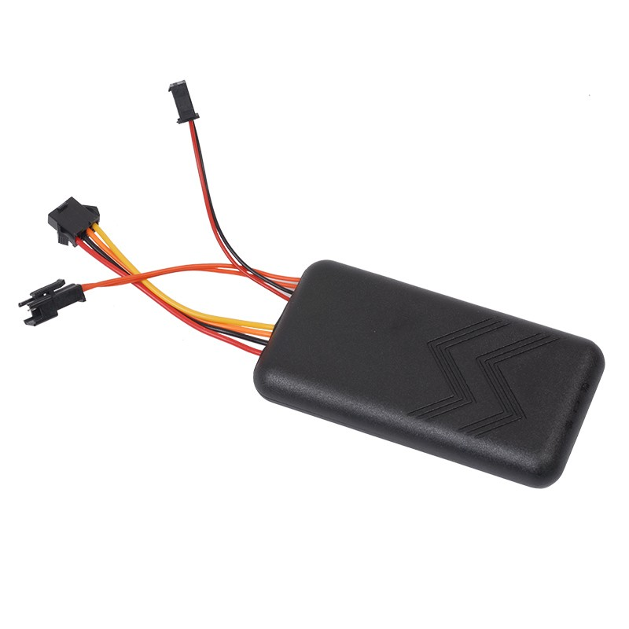

# TK-Star - TK970

The TK970 4G from TK-Star is a compact vehicle GPS tracker engineered for motorcycles, private cars, rental fleets and mixed vehicle assets. Designed to deliver reliable multi‑mode positioning and telematics, the TK970 supports GNSS and network fallback methods to maintain location reporting across both urban and remote environments. Its small form factor and integrated security features make it suitable for a range of mobile tracking scenarios.

Plaspy compatibility is built in, so the TK970 can transmit position and event data directly to Plaspy for live monitoring, alerting and historical reporting. That out of the box integration lets operators and owners use Plaspy dashboards and notification rules to turn location and event data from the TK970 into operational visibility and incident response capabilities.

## Key Highlights

- Plaspy compatible for direct integration with real time tracking, alerts and fleet dashboards.
- Multi mode positioning with GNSS plus network fallback to improve coverage in mixed environments.
- Security oriented features including SOS emergency button, vibration alarm and relay based remote engine or oil cut off for anti theft response.
- Compact and robust form factor suitable for motorcycles, cars and mixed vehicle assets.
- Broad cellular support across regional 4G variants and legacy 2G options for wide deployment.
- On device telemetry such as built in microphone, geo fence and movement alerts with server side route history.
- Internal backup battery provides short term standby when external power is lost.

## How It Works with Plaspy

When installed in a vehicle, the TK970 transmits positioning and event data over cellular networks to Plaspy where the platform ingests coordinates, fallback positions and telematics events. Plaspy consolidates the incoming data so fleet managers and vehicle owners can view live location, receive automated alerts and review historical routes in a single interface.

- Live location and telemetry updates delivered to Plaspy for mapping and fleet monitoring.
- SOS and emergency notifications forwarded through Plaspy for timely awareness.
- Relay state and remote immobilizer actions recorded and controllable from the Plaspy platform.
- Event alerts such as geo fence breaches, vibration alarms, movement and over speed routed to Plaspy rules and notification channels.
- Historical route storage available for playback and reporting to support investigations and compliance.

## Typical Use Cases

- Fleet management of cars, vans and mixed vehicle assets with centralized monitoring and route history.
- Anti theft protection using vibration alerts, SOS and remote engine or oil cut off to deter or respond to theft.
- Rental vehicle and scooter monitoring for location based billing, incident investigation and asset recovery.
- Motorcycle and compact asset tracking where small form factor and fallback positioning are important.
- Operational oversight and reporting where consolidated telemetry supports dispatch and maintenance workflows.

## Why Choose This Tracker with Plaspy

The TK970 pairs practical hardware features with Plaspy’s platform capabilities to provide straightforward vehicle visibility and event driven workflows. Its combination of compact design, multi mode positioning and basic security controls makes it a flexible option for organizations that need consistent location data without unnecessary complexity.

When used with Plaspy, the TK970’s position and event streams become part of centralized dashboards, alerting rules and historical playback that support everyday fleet operations, anti theft measures and post incident review. The available information is broad and functional, so evaluating the TK970 together with Plaspy lets teams decide how the device fits into their existing tracking and reporting processes.

To learn more about how Plaspy supports devices like the TK970 visit https://www.plaspy.com. Product specifications, availability and manufacturer details can change over time, so please verify current technical information and compatibility on the official TK Star website https://www.tk-star.com/.
