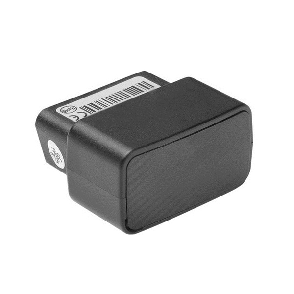

# TK-Star - TKOBD

The TKOBD 2G by TKSTAR is a compact OBD plug‑in GPS tracker engineered for reliable vehicle tracking and fleet management. Designed to be Plaspy compatible, it delivers continuous real‑time tracking and server‑based route history so fleet operators and vehicle owners can monitor location, movement alerts, and performance from web and mobile apps.

The TKOBD 2G combines multi‑source positioning \(GPS, GLONASS, BDS/BD, LBS and Wi‑Fi\) with an IP65 ruggedized enclosure for everyday automotive use. Its plug‑in form factor simplifies installation and helps businesses scale telemetry and anti‑theft monitoring across cars, light commercial vehicles, and rental fleets while integrating smoothly with Plaspy’s tracking dashboard.

## Key Highlights

- Plaspy compatible OBD plug‑in GPS tracker for quick, no‑tools installation into the vehicle’s OBD port.
- Multi‑source positioning \(GPS/GLONASS/BDS plus LBS and Wi‑Fi\) for accurate outdoor and improved indoor location reporting.
- Real‑time tracking and alerts via web and mobile apps — ideal for fleet management and anti‑theft monitoring.
- Configurable safety and security alarms: vibration alarm, move alert, geo‑fence breach and overspeed alarm for driver behavior and theft detection.
- Server‑side route history stored up to six months for compliance, analysis, and incident review.
- Rugged IP65 rating and wide operating voltage range \(10–40 V\) to withstand automotive environmental conditions.
- Small, lightweight design supports discrete installation and broad vehicle compatibility.

## How It Works with Plaspy

The TKOBD 2G communicates location and status data over GSM/GPRS to backend servers where Plaspy ingests and displays it in real time. Once connected, Plaspy shows live positions, configurable alerts, and historic routes from the device so fleet managers and owners can act on telemetry and safety events immediately.

- Real‑time location and telemetry updates streamed to Plaspy for live tracking and dispatch.
- Instant alerts for vibration, movement, geo‑fence breaches and overspeed events routed into Plaspy notifications.
- Server storage of historical routes for up to six months, allowing retrospective trip review and compliance reporting.
- OBD plug‑in design provides convenient vehicle power and simplifies rollout across fleets without hardwiring.
- Works with Plaspy’s web and mobile apps to centralize tracking, reporting, and fleet management workflows.

## Technical Overview

| Connectivity | GSM / GPRS \(2G\) |
| --- | --- |
| Bands | 850 / 900 / 1800 / 1900 MHz |
| Power & Battery | Working voltage 10–40 V; internal rechargeable backup battery 3.7 V, 80 mAh Li‑ion |
| Interfaces | OBD plug‑in form factor for vehicle power and connection \(no hardwire required\) |
| GNSS | UBLOX GNSS chip; multi‑source positioning including GPS, GLONASS and BDS/BD; sensitivity –159 dBm; typical accuracy ~5 m; TTFF ~35–80 s cold, ~35 s warm, ~1 s hot |
| Sensors & Alerts | Vibration alarm, move alert, geo‑fence breach, overspeed alarm |
| Server & History | Real‑time tracking via web/mobile APP; historical routes stored on server up to six months |
| Form Factor & Environmental | Dimensions ~42 × 53.7 × 22 mm, weight ~28 g; IP65 rated; storage –40°C to +85°C; operating –20°C to +55°C; humidity 5%–95% non‑condensing |

## Use Cases

- Fleet management — monitor vehicle positions, route history and overspeed events to improve routing and driver safety.
- Anti‑theft and recovery — vibration and move alerts notify Plaspy users immediately when unauthorized movement occurs.
- Rental and shared vehicles — quick OBD installation and six‑month route history help operators audit usage and protect assets.
- Driver behavior and compliance — use geofence and overspeed alerts to enforce policies and document incidents for review.

## Why Choose This Tracker with Plaspy

Choosing the TKOBD 2G for a Plaspy deployment delivers a practical balance of accuracy, durability, and simplicity. Its multi‑source positioning and UBLOX GNSS chipset provide reliable real‑time tracking for fleet management and anti‑theft workflows, while the OBD plug‑in form factor makes installation fast and scalable. Plaspy aggregates the TKOBD 2G’s telemetry and alerts into a single dashboard, enabling centralized reports, live dispatching, and efficient incident response.

For fleets that also use fuel monitoring, ignition or immobilizer events, or Bluetooth sensors in an extended telematics stack, Plaspy can correlate TKOBD 2G location and alarm data with those additional inputs when available from other hardware. That flexibility helps operators build a comprehensive solution without compromising the TKOBD 2G’s compact, robust design.

