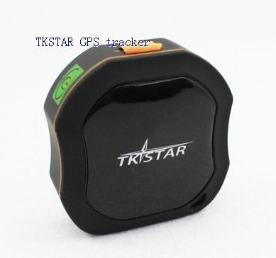

# TK-Star - TKSTAR

The TK-Star TKSTAR GPS Portable Tracker is a compact, versatile device designed for real time location tracking and monitoring. Built for portability and everyday use, it is positioned to help users track private cars, rental vehicles, equipment, and personal items. The device also supports personal safety use cases for children, elderly family members, and pets, as well as authorized security and supervision contexts where discreet monitoring is required.

As a Plaspy compatible device, the TKSTAR can feed live position updates and event alerts into Plaspy for centralized visibility and management. That compatibility makes it a practical choice for small fleets, field teams, or anyone who needs consolidated tracking, geofence alerts, historical traces, and operational oversight within the Plaspy platform.

## Key Highlights

- Real time tracking functionality for continuous location visibility
- Portable and compact design for use on vehicles, equipment, or people
- History trace and auto tracking features for reviewing past movements
- Geofence support with entry and exit alerts for perimeter monitoring
- Built in SOS button and movement alerts for emergency and security events
- IP66 waterproof rating and a sleep mode for improved durability and battery conservation

## How It Works with Plaspy

When used with Plaspy, the TK-Star TKSTAR provides location and event data that Plaspy presents on maps, event lists, and reports to support operational decisions. Plaspy collects the tracker signals and makes them available through dashboards and notifications for teams managing assets or personnel.

- Live location display and continuous position updates in Plaspy maps
- Historical route playback and event history for investigations and audits
- Geofence configuration alerts delivered and logged in Plaspy
- Alarm handling for SOS, movement, overspeed, and low battery events
- Remote monitoring and status visibility for fleet or asset oversight
- Reporting and exportable activity logs to support operational review

## Typical Use Cases

- Tracking private cars and rental vehicles for location visibility
- Managing portable equipment and assets during transport or storage
- Personal safety monitoring for children, elderly relatives, or pets
- Field staff oversight and basic workforce location coordination
- Authorized supervision or monitoring scenarios that require discreet tracking
- Emergency alerting for individuals who need quick assistance

## Why Choose This Tracker with Plaspy

The TKSTAR combines a compact form factor with a practical set of tracking and alert features, making it a sensible option for organizations and individuals who need straightforward location monitoring. Paired with Plaspy, the device’s real time updates, geofence alerts, and history trace capabilities translate into clearer situational awareness and easier operational management.

For teams that need a durable portable tracker, the TKSTAR’s waterproof rating and sleep mode help maintain reliable operation in varied conditions while keeping power use under control. Using Plaspy as the management layer gives operators centralized visibility, notification routing, and reporting that turn raw device signals into actionable information.

To learn more about Plaspy and how it can work with devices like the TK-Star TKSTAR visit https://www.plaspy.com. Product specifications, availability, and manufacturer details can change over time, so please verify current technical information on the manufacturer website https://www.tk-star.com/.
