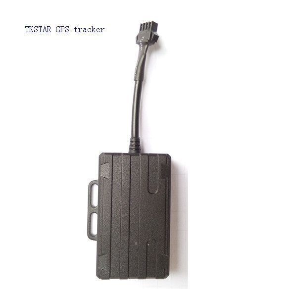

# TK-Star - XE210

The TK-Star XE210 is a compact and versatile GPS tracker designed to locate and monitor vehicles, people, and valuable assets. It combines GPS and AGPS dual positioning and uses existing cellular networks and satellite positioning to provide real-time location information. The XE210 includes features commonly required for practical tracking tasks such as historical route logging, geo-fencing, over-speed alarms, vibration alerts, and remote voice monitoring.

As a device compatible with Plaspy, the XE210 can be integrated into a centralized fleet and asset management workflow. Plaspy can receive location updates and event notifications from the tracker, allowing operators to view positions on maps, review historical routes, and configure alerts. This makes the XE210 a relevant option for organizations that want a compact tracker with multiple reporting methods and the ability to feed location data into Plaspy for monitoring and reporting.

## Key Highlights

- Dual positioning with GPS and AGPS for improved location reliability
- Supports multiple tracking and reporting methods including SMS, app, and internet
- Compact and lightweight form factor suitable for discreet placement
- Built-in alarms and monitoring features such as vibration alert, low battery alarm, and over-speed alarm
- Historical route tracking and geo-fencing for retrospective analysis and zone monitoring
- Remote voice monitoring and multi platform viewing options for flexible oversight

## How It Works with Plaspy

The XE210 sends location updates and event notifications over available network methods to be consumed by Plaspy, where data is consolidated, visualized, and acted upon. Plaspy provides the interface to monitor live positions, view historical tracks, and manage alerts generated by the tracker.

- View live location and status of each XE210-equipped asset on Plaspy maps
- Receive and manage alerts such as geo-fence breaches, low battery warnings, and over-speed events
- Review historical routes and playback movements for reporting and analysis
- Consolidate multiple trackers into fleet dashboards for operational oversight
- Use Plaspy reporting tools to export location histories and event logs for audits and performance review

## Typical Use Cases

- Vehicle fleet tracking and oversight for small to medium fleets
- Monitoring high-value portable assets in transit or storage
- Personal tracking for caregivers keeping tabs on loved ones
- Short term rental or loaned equipment tracking with periodic checks
- Delivery and logistics monitoring where compact discreet trackers are needed

## Why Choose This Tracker with Plaspy

The TK-Star XE210 pairs a compact hardware profile with a set of practical tracking features that suit a variety of monitoring needs. Its multiple reporting options and core alarms make it a flexible choice for organizations that want to add discreet location sensing to their operations and feed that data into a single management platform.

When used with Plaspy, the XE210’s location and event information becomes part of a larger operational view, enabling live monitoring, historical analysis, and configurable alerts without requiring specialized on site systems. This combination is useful for teams that need straightforward tracking capabilities and centralized visibility for fleet or asset management.

To learn more about how Plaspy can manage trackers like the TK-Star XE210 visit https://www.plaspy.com. Product specifications, availability, and manufacturer details can change over time; please verify current technical information on the official manufacturer site https://www.tk-star.com/ before making purchases or deployment decisions.
