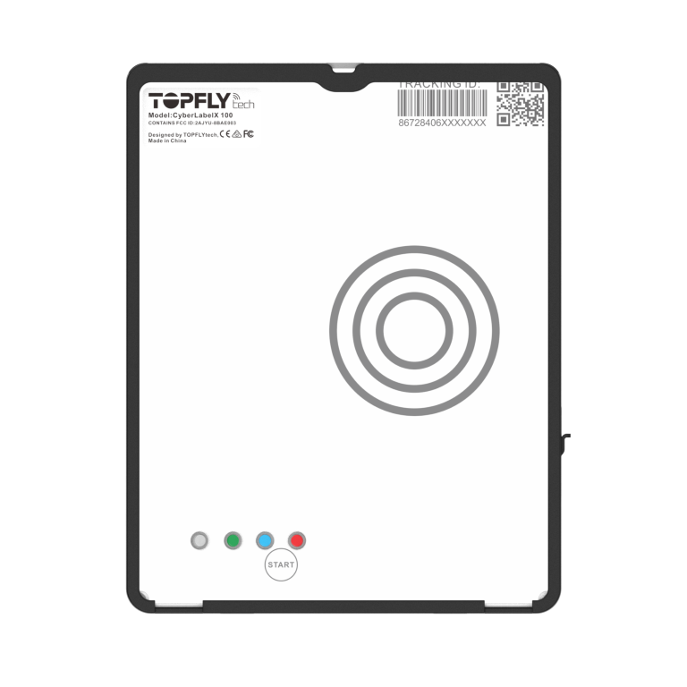

# TopFly - CyberLabelX 100

The CyberLabelX 100 is a slim, rechargeable asset GPS tracker purpose built for parcel level and high value shipment visibility. Designed to attach discreetly to cartons and returnable assets, it combines multi constellation GNSS positioning, configurable reporting intervals down to every 3 seconds, and buffered logging to preserve continuous location history when cellular coverage is intermittent.

As a Plaspy compatible device out of the box, the CyberLabelX 100 delivers location, environmental telemetry and event alerts into Plaspy dashboards and APIs. Its combination of tamper awareness, motion sensing and temperature monitoring makes it a practical choice for logistics teams and asset managers who want parcel level visibility surfaced through Plaspy for tracking, alerts and historical reporting.

## Key Highlights

- Plaspy compatible out of the box with standard transport options for cloud integration and real time tracking.
- Slim rechargeable design with wireless charging and long operational profiles for multi day deployment.
- Multi constellation GNSS positioning for precise parcel and container location reporting.
- Configurable reporting intervals down to every 3 seconds and buffered logging to prevent data loss during network outages.
- Internal ambient light, motion and temperature sensors plus support for an optional external temperature or temperature and humidity probe for cold chain needs.
- Compact form factor with adhesive or zip tie mounting and a durable enclosure suited to parcel and asset attachment.

## How It Works with Plaspy

When paired with Plaspy, the CyberLabelX 100 streams location fixes, sensor telemetry and alarm events into your Plaspy account where they can be visualized, filtered and reported. Buffered points collected while a device is offline sync automatically when connectivity returns, preserving continuity for logistics analysis and audits.

- Real time location updates and configurable reporting intervals visible in Plaspy dashboards.
- Tamper and visibility alerts derived from the ambient light sensor that can trigger notifications and workflows.
- Motion detection events to indicate handling or unauthorized movement and to support operational alerts.
- Temperature monitoring from the internal sensor and optional external probe for cold chain oversight in Plaspy reports.
- Buffered logging and automatic upload to Plaspy when the device regains network access for complete historical playback.

## Typical Use Cases

- Parcel and carton tracking for last mile visibility and delivery confirmation in e commerce operations.
- High value asset transit monitoring where discreet rechargeable trackers reduce theft and loss risk.
- Cold chain shipments using the optional external temperature or temperature and humidity probe to monitor thermal exposure.
- Returnable asset flows for pallets, crates and roll cages where a slim adhesive mount is required.
- Discreet tagging for short term or temporary shipment monitoring across complex logistics networks.

## Why Choose This Tracker with Plaspy

The CyberLabelX 100 is well suited to organizations that need compact, long life tracking for non powered assets and parcels while using Plaspy for centralized monitoring. Its combination of precise GNSS positioning, buffered logging and environmental sensing gives logistics teams actionable visibility without requiring larger vehicle focused telematics hardware.

If your deployment requires vehicle specific telematics such as ignition inputs or on board vehicle diagnostics, pair CyberLabelX 100 parcel tracking with other telematics modules within your Plaspy solution. For shipment and asset scenarios that emphasize discreet mounting, long battery life and temperature awareness, this tracker is a practical complement to Plaspy.

To learn more about using the CyberLabelX 100 with Plaspy visit https://www.plaspy.com for platform information. Product specifications and availability can change over time, so verify current technical details and supported accessories on the manufacturer site https://www.topflytech.com/.
