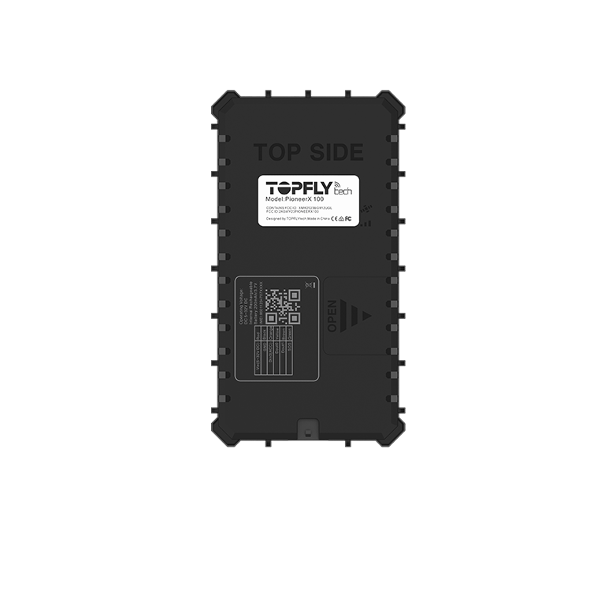

# TopFly - PioneerX 100

The PioneerX 100 is a compact, hardwired GPS tracker from TopFly designed for reliable fleet management and asset tracking. It combines high sensitivity GNSS positioning with global cellular connectivity and configurable digital and analog inputs and outputs to support ignition detection, immobilizer control and accessory monitoring. The unit is built for continuous operation in demanding conditions and includes a backup battery to preserve critical data during power interruptions.

As a device compatible with Plaspy out of the box, the PioneerX 100 can deliver frequent location updates, event alerts and historical telemetry into Plaspy dashboards and reports. Its support for multi constellation GNSS, broad cellular coverage and optional Bluetooth sensor pairing make it a practical choice for operators who want visibility, anti theft workflows and condition monitoring integrated into the Plaspy platform.

## Key Highlights

- Plaspy compatible hardwired GPS tracker designed for fleet and asset management.
- High sensitivity multi constellation GNSS positioning for reliable location accuracy.
- Global 4G CAT 1 connectivity with 2G fallback for broad cellular reach and continuous reporting.
- Configurable digital and analog I O for ignition detection, relay control and SOS integration.
- BLE support for pairing with sensor accessories to enable environmental and cargo monitoring.
- Built in backup battery to preserve messages and state during power loss.
- Rugged design suited for a wide temperature range and optional water resistant casing.

## How It Works with Plaspy

When the PioneerX 100 is pointed to Plaspy, the device sends location, event and sensor data to Plaspy servers so fleet operators can view live positions, receive alerts and review historical movement. Plaspy ingests the device messages and presents them through maps, notifications and reporting tools that support operational oversight and incident response.

- Live location updates and frequent position reporting for real time monitoring in Plaspy.
- Event and alarm reporting from digital inputs such as ignition, door and SOS for fast alerts.
- Sensor and analog telemetry delivered to Plaspy for condition based notifications and trend reporting.
- Offline cached positions uploaded automatically after connectivity is restored to preserve historical trails.
- Remote control events such as relay or immobilizer actions can be reflected in Plaspy for coordinated response and logging.

## Typical Use Cases

- Fleet management and logistics with real time vehicle tracking and operational reporting.
- Vehicle anti theft and immobilization workflows using ignition detection and relay control.
- Cold chain and cargo condition monitoring using paired sensors for temperature and humidity alerts.
- Remote asset tracking where cached location points preserve history through connectivity gaps.
- OEM and service integrations that require compact configurable tracking hardware for vehicles and equipment.

## Why Choose This Tracker with Plaspy

The PioneerX 100 pairs practical hardware features with the visibility and reporting capabilities of Plaspy, making it a sensible option for organizations that need dependable tracking, event alerts and telemetry integration. Its configurable inputs and outputs, sensor pairing options and robust offline caching help ensure continuity of data and flexible workflows for anti theft and operational monitoring.

To learn more about how Plaspy supports devices like the PioneerX 100 visit https://www.plaspy.com. Product specifications, availability and manufacturer details can change over time, so please verify current specifications and accessory options with the manufacturer at https://www.topflytech.com/.
