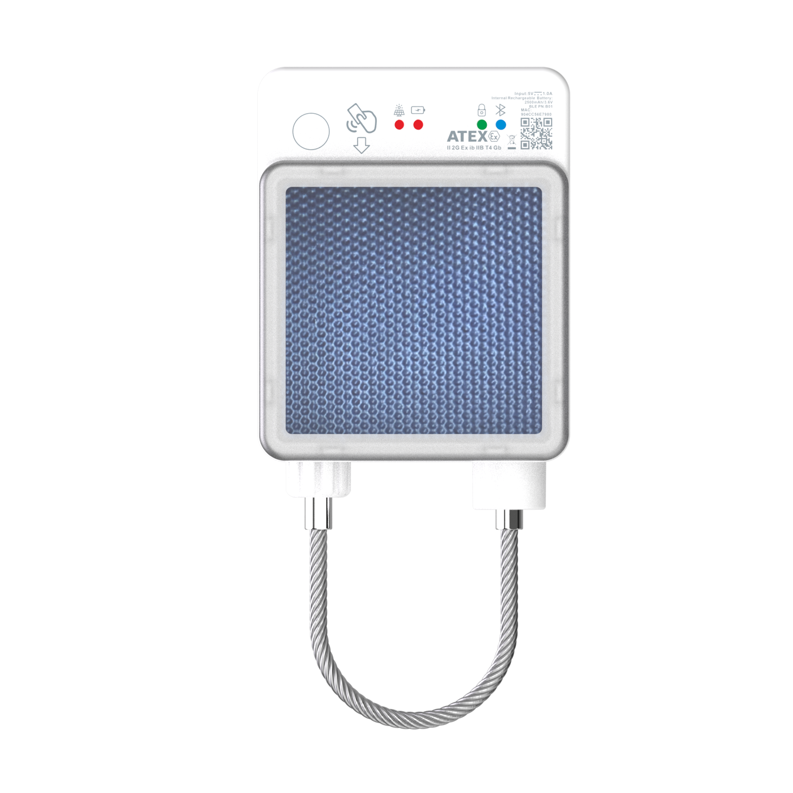

# TopFly - SolarGuardX 120

SolarGuardX 120 is a rugged, solar-powered sub-lock engineered for secure remote asset protection and synchronized multi-lock operation. Designed for harsh outdoor environments, the SolarGuardX 120 brings long-life, low-maintenance security to containers, trailers, pallets and high-value assets while integrating cleanly into Plaspy-compatible workflows to add telemetry, tamper alerts and multi-point access control to your GPS tracker and fleet management setup.

Plaspy-compatible out of the box, the SolarGuardX 120 contributes real-time security telemetry and status events that augment GPS tracker position feeds, enabling combined anti-theft monitoring, synchronized unlocking across master/slave locks, and centralized reporting for logistics operations. The unit’s BLE 5.3 long-range connectivity, onboard solar charging and FOTA updates make it a practical choice for large-scale deployments where uptime and remote diagnostics are essential.

## Key Highlights

- Plaspy compatible — delivers tamper, battery and lock-state telemetry to complement GPS tracker location data and fleet management dashboards.
- Solar-assisted operation — onboard solar panel plus a rechargeable 2500 mAh Li‑Polymer battery reduces maintenance and extends field life.
- Long-range BLE 5.3 — secure Bluetooth Low Energy control and diagnostics with extended range for master/slave coordination \(up to 1000 m open field at 8 dBm\).
- Rugged, IP67 weatherproof housing — engineered for outdoor logistics with an operating range from −40 °C to 85 °C.
- Multi-lock master/slave capability — synchronized locking/unlocking across multiple secondary locks for coordinated access events.
- Local alarms and LED status — movement, tamper/rope-cut, lid opening and locking events produce local alerts and visible indicators for quick diagnostics.
- FOTA and USB Type‑C — firmware updates and data communication simplify remote management and lifecycle maintenance.

## How It Works with Plaspy

SolarGuardX 120 provides security and telemetry data that Plaspy ingests alongside GPS tracker position feeds to create a unified view of asset condition and access events. Use Plaspy to correlate GPS-based location and routing with SolarGuardX 120 events \(tamper, open/close, battery state, master/slave lock actions\), enabling real-time tracking, alerting and historical reporting across your fleet or asset pool.

- Real-time telemetry and event alerts — battery level, solar charge status, motion/tamper alarms and lid/open events feed into Plaspy so operators see security events alongside location.
- Master/slave lock coordination — Plaspy records synchronized unlock/lock actions for multi-point access workflows and audit trails.
- BLE gateway integration — BLE telemetry can be collected via Plaspy-compatible gateways or mobile apps to associate SolarGuardX 120 status with GPS tracker data.
- FOTA and diagnostics — remote firmware updates and USB data access enable Plaspy-driven maintenance and version control across deployments.
- Complementary systems — SolarGuardX 120 augments Plaspy’s fleet management features and can be combined with fuel monitoring, ignition/immobilizer status and other telemetry from GPS trackers for a complete asset picture.

## Technical Overview

| Model | SolarGuardX 120 |
| --- | --- |
| Connectivity | Bluetooth Low Energy \(BLE 5.3\), USB Type‑C data port |
| BLE Range | Long-range BLE \(up to 1000 m open field at default 8 dBm\) |
| Power & Battery | Rechargeable Li‑Polymer 2500 mAh / 3.7 V; onboard solar panel for charging; 2‑pin charging port \(recommended 5 V, 1 A adapter, approx. 3 h charge\) |
| Alarms & Sensors | Local alarms for rope/cable cut, movement, parking, locking/unlocking and lid opening; single temperature sensor; LED indicators for solar charge, battery, BLE and RFID |
| Interfaces | USB Type‑C \(data\), 2‑pin charging port, physical power switch, RFID, BLE control |
| Form Factor & Mounting | Dimensions 113.8 × 90 × 36.9 mm; weight 1060 g; built-in strong magnet for quick mounting on metallic assets |
| Environmental | IP67 weatherproof housing; operating temperature −40 °C to 85 °C |
| Firmware & Management | FOTA \(firmware over the air\) support; USB data connection for diagnostics |
| Certifications | CE, FCC, IP67, ATEX completed; additional certifications planned by manufacturer |
| Control Modes | BLE control, master-slave lock configuration, RFID support |

## Use Cases

- Container and trailer logistics — synchronized master/slave locks secure multi-point access and provide audit trails for container deliveries and pickups.
- High-value asset protection — integrate SolarGuardX 120 telemetry into Plaspy to detect tamper or movement and trigger anti-theft alerts alongside GPS tracker location.
- Cold-chain or sensitive cargo — BLE sensors and the onboard temperature sensor provide local condition awareness that can be reported to Plaspy for compliance checks.
- Distributed asset fleets — long-life solar charging and IP67 housing make the unit suitable for pallets, equipment and remote assets needing low-maintenance security.
- Coordinated multi-lock operations — logistics workflows benefit from a master lock controlling multiple slaves for synchronized access across a vehicle or load.

## Why Choose This Tracker with Plaspy

SolarGuardX 120 is purpose-built to extend Plaspy’s GPS tracker and fleet management capabilities with dedicated anti-theft and access-control telemetry. Its solar-assisted battery and rugged IP67 housing minimize field service while the BLE long-range and master/slave modes simplify coordinated operations across containers and trailers. When combined in a Plaspy deployment, SolarGuardX 120 helps reduce theft risk, improves auditability of access events, and provides real-time telemetry that complements location, fuel monitoring, ignition/immobilizer status and other vehicle data collected by GPS trackers. The result is a scalable, low-maintenance security layer that enhances situational awareness and operational control for logistics and asset managers.

