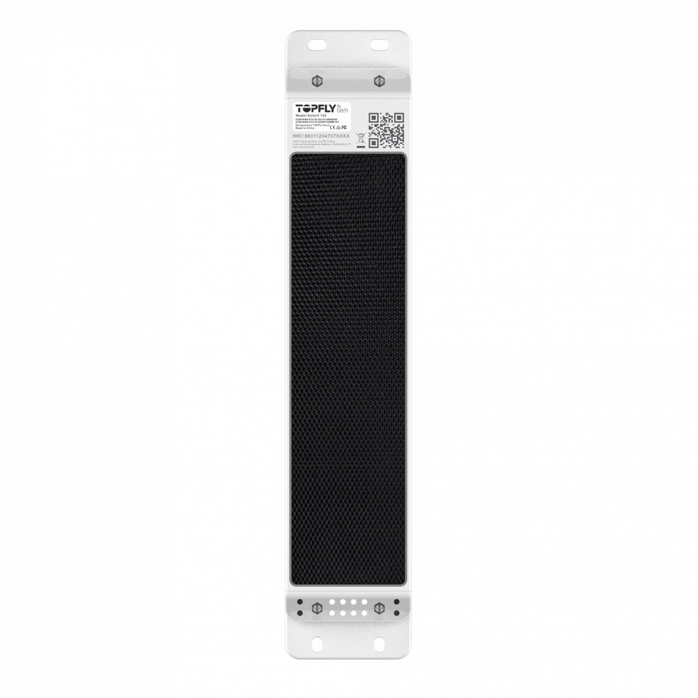

# TopFly - SolarX 130

SolarX 130 is a rugged GPS tracker designed for container, trailer and outdoor asset visibility. Built for harsh environments, the device combines solar charging, long-life rechargeable batteries and external sensor support to provide continuous location updates and buffered telemetry during long deployments, including maritime and remote operations.

As a Plaspy compatible tracker, SolarX 130 can feed location, movement and sensor data into Plaspy for visualization, alerts and reporting. Its buffered storage, high-frequency reporting options and event alarms make it a practical choice for organizations that need persistent location intelligence and operational oversight inside the Plaspy platform.

## Key Highlights

- Solar-assisted power with large battery options to reduce maintenance intervals and extend field life
- Compatible with Plaspy for live tracking, telemetry capture and event forwarding
- High-frequency location updates configurable for detailed movement and route visibility
- Large offline buffer capable of storing a long history of GPS points when connectivity is lost
- IP67-rated rugged housing suited for outdoor, port and maritime deployments
- Support for external sensors for temperature humidity and door status to aid condition monitoring
- Movement removal and low-battery alerts to support anti-theft and asset protection workflows

## How It Works with Plaspy

SolarX 130 transmits location updates, movement events and sensor readings to Plaspy so teams can monitor assets, receive alerts and review historical routes. Plaspy ingests the device telemetry, applies configured triggers and presents data in dashboards and reports for operational decision making.

- Real-time location and telemetry updates sent to Plaspy for live visibility and map tracking
- Buffered offline storage uploaded to Plaspy when connectivity returns, preserving route history
- Movement removal and parking alarms forwarded to Plaspy to trigger notifications and incident tracking
- External sensor readings such as temperature humidity and door-status reported to Plaspy for condition monitoring
- Telemetry and events available to drive automated workflows and reporting inside Plaspy

## Typical Use Cases

- Container and trailer tracking across ports and long-haul routes with intermittent connectivity
- Cold-chain monitoring using external sensors to report temperature and humidity to Plaspy
- Anti-theft monitoring with removal and movement alerts routed to operations teams
- Outdoor fleet management in harsh and maritime environments where durable telemetry is required
- Remote asset monitoring requiring large offline history to reconstruct routes and verify presence

## Why Choose This Tracker with Plaspy

SolarX 130 is a practical fit for organizations that need durable, low-maintenance tracking combined with sensor-aware telemetry. Its solar-assisted power and rugged form factor reduce the frequency of site visits, while buffered storage and frequent reporting options help maintain continuous location intelligence for distributed assets. When paired with Plaspy, the tracker’s events and sensor readings become actionable information that supports monitoring, compliance and rapid response.

If you want to evaluate SolarX 130 for your Plaspy deployment, this tracker provides a balance of robustness and data continuity well suited to containers trailers and outdoor assets. Learn more about Plaspy on the main website https://www.plaspy.com. Product specifications availability and manufacturer details can change over time so verify current specifications on the official TopFly site https://www.topflytech.com/
