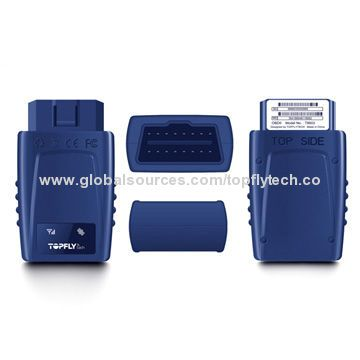

# TopFly - T8603

The TopFly T8603 GPS tracker is a compact and versatile device that offers a range of features to help you keep track of your valuable assets. With its plug and play functionality, it is incredibly easy to set up and start using. The T8603 is designed with low energy consumption in mind, ensuring that it won't drain your battery or power source quickly. It also has low consumption of GPRS, making it an efficient choice for long-term tracking.

One of the standout features of the T8603 is its smart power on or off capability. This means that the tracker will automatically turn on or off based on the movement of the asset it is attached to, helping to conserve power when it is not in use. The sleep mode and elegant attention features further enhance the power-saving capabilities of the device.

The T8603 is equipped with internal antennas for both GSM and GPS signals, ensuring reliable and accurate tracking. Inserting a SIM card is a breeze, making it quick and easy to get the tracker up and running. Once activated, the T8603 offers a range of functions to meet your tracking needs. Real-time monitoring allows you to keep an eye on your assets at all times, while the geo-fence reaction feature alerts you if the tracker goes outside of a predefined area. Vibration alerts, trailed alarms, overspeed alarms, and anti-theft alarms provide additional security and peace of mind.

With its user-friendly design and impressive range of features, the TopFly T8603 GPS tracker is an excellent choice for anyone looking to track and protect their valuable assets. Whether you need to keep tabs on a vehicle, equipment, or any other valuable item, the T8603 has you covered.

### Key Features:

- Plug and play functionality
- Low energy consumption
- Low consumption of GPRS
- Smart power on or off
- Sleep mode and elegant attention
- Internal antennas for GSM and GPS
- Easy SIM card insertion
- Real-time monitoring
- Geo-fence reaction
- Vibration alert
- Trailed alarm
- Overspeed alarm
- Anti-theft alarm

