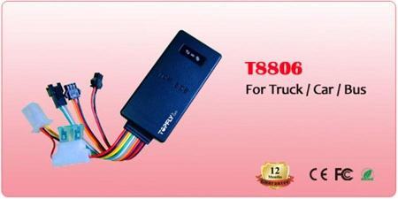

# TopFly - T8806

The TopFly T8806 GPS tracker is a versatile and feature-packed device that offers a wide range of functions to help you keep track of your vehicles. With real-time tracking, you can monitor the location of your vehicle at any time, ensuring that you always know where it is. The historical waypoint record allows you to view the route history of your vehicle, giving you valuable insights into its past movements.

One of the standout features of the T8806 is its ability to remotely immobilize your vehicle. This means that in the event of theft or unauthorized use, you can disable the engine and prevent the vehicle from being driven. The tracker also offers overspeed alarm, geo-fence alarm, and tow alarm features, providing you with additional security and peace of mind.

In addition to its security features, the T8806 also offers a range of other useful functions. With two-way audio, you can communicate with the driver or passengers in your vehicle, making it ideal for fleet management or monitoring the safety of loved ones. The tracker also has an SOS call feature, allowing the driver to quickly call for help in an emergency situation.

Other notable features of the T8806 include theft alarm \(unauthorized ACC disconnected\), fuel detection, fuel leakage alarm, temperature detection, car door motion detection, and air-conditioner detection. These features make the T8806 a comprehensive and reliable GPS tracker that can meet the needs of a variety of users.

### Key Features:

- Real-time tracking
- Historical waypoint record
- Remotely immobilization control
- Overspeed alarm
- Geo-fence alarm
- Tow alarm
- Two-way audio
- SOS calls
- Theft alarm \(Unauthorised ACC disconnected\)
- Fuel detection
- Fuel leakage alarm
- Temperature detection
- Car door motion detection
- Air-conditioner detection

