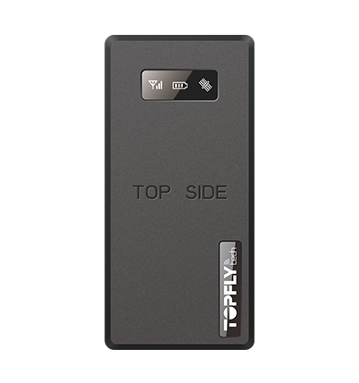

# TopFly - T8806+R

The TopFly T8806+R is a hardwired 2G tracker designed for powered assets and vehicles. It provides ignition detection and dedicated outputs for relays, buzzers, or sirens, along with a built in GNSS chipset that supports multiple global navigation systems. The device offers both real time location reporting and a large onboard buffer for location points, making it suitable for continuous tracking and recovery of position history when connectivity is limited.

As a Plaspy compatible device, the T8806+R can be integrated into fleet and asset monitoring workflows to deliver position updates, event alerts, and historical traces within the Plaspy platform. Its support for BLE sensors, analog and RS232 inputs, and a backup battery for disconnection alerts makes it a flexible option for operators who need expanded monitoring or fuel sensing capabilities combined with Plaspy's visibility and reporting tools.

## Key Highlights

- Hardwired 2G tracker with ignition detection and outputs for relay or alarm devices
- Real time location updates with high frequency reporting and a buffer that stores up to 60,000 points
- Built in GNSS support for multiple satellite systems for reliable positioning
- BLE 4.0 support to extend monitoring with compatible temperature, humidity, door, and wireless sensors
- Analog and RS232 inputs enabling compatibility with fuel sensors and other external devices
- Backup battery and disconnection alerts to maintain awareness when main power is removed

## How It Works with Plaspy

When paired with Plaspy, the TopFly T8806+R feeds location and event data into the platform to support live monitoring, historical analysis, and operational alerts. Plaspy can use the tracker's buffered storage to recover location history after connectivity interruptions, and its event reporting to trigger notifications and reports.

- Display live vehicle and asset location on Plaspy maps with frequent update capability
- Surface ignition, power disconnection, and safety related alerts within Plaspy dashboards
- Use buffered location points to rebuild tracks when a device reconnects after coverage gaps
- Incorporate BLE sensor readings and external sensor inputs into Plaspy reporting where supported
- Generate operational reports and alerts in Plaspy driven by events detected by the tracker

## Typical Use Cases

- Fleet vehicle tracking for route visibility and operational oversight
- Powered asset monitoring where ignition status and tamper alerts are required
- Fuel monitoring integration using an ultrasonic fuel sensor through analog or RS232 input
- Environmental or condition monitoring by pairing BLE temperature and humidity sensors
- Security and misuse detection using event alerts for harsh driving, crashes, or disconnection

## Why Choose This Tracker with Plaspy

The TopFly T8806+R is well suited to organizations that require a compact, hardwired tracker with a broad set of inputs and sensor expansion options. Its combination of real time updates, large onboard buffer, and event detection features makes it practical for fleets that need continuous visibility and reliable historical traces. For operations that also want to monitor temperature, doors, or fuel, the device's BLE and input options provide useful extensions without changing core tracking workflows.

Paired with Plaspy, the T8806+R can contribute to a complete monitoring solution that combines location awareness, event alerting, and reporting. Plaspy helps turn the tracker's raw data into operational insight for fleet managers, dispatchers, and maintenance teams while allowing organizations to adapt the setup to their specific needs.

To learn more about Plaspy and how compatible devices are used on the platform visit https://www.plaspy.com. Product specifications, availability, and manufacturer details can change over time, so verify the current technical specifications and compatibility information on the official TopFly website https://www.topflytech.com/.
