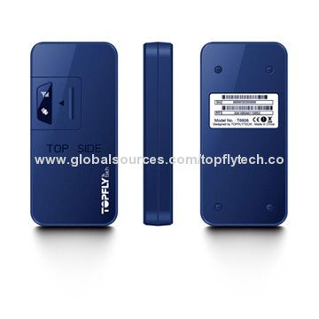

# TopFly - T8808

The TopFly T8808 GPS tracker is a reliable and efficient device designed to provide real-time monitoring and tracking capabilities. With its low energy consumption and low consumption of GPRS, this tracker ensures long-lasting performance without draining your vehicle's battery. The T8808 also features a smart power on or off function, allowing you to easily control the device's power status.

Equipped with internal antennas for both GSM and GPS signals, the T8808 offers accurate and reliable positioning information. Inserting a SIM card is a breeze, making it quick and easy to set up the tracker for use. Whether you need to track your personal vehicle or monitor a fleet of vehicles for your business, the T8808 is a versatile solution that meets your needs.

Some of the outstanding features of the TopFly T8808 GPS tracker include:

- Real-time monitoring: Keep track of your vehicle's location and movement in real-time.
- Immobilization: Remotely immobilize your vehicle to prevent unauthorized use.
- Geo-fence reaction: Receive alerts when your vehicle enters or exits a predefined area.
- Vibration alert: Get notified if there is any unauthorized movement or tampering with your vehicle.
- Trailed alarm: Receive an alarm if your vehicle is being towed or transported without your knowledge.
- Overspeed alarm: Set a speed limit and receive alerts if your vehicle exceeds it.
- Anti-theft alarm: Get notified if there is any suspicious activity or attempted theft of your vehicle.

The TopFly T8808 GPS tracker is a reliable and feature-packed device that offers peace of mind and enhanced security for your vehicle. With its easy installation and user-friendly interface, it is suitable for both personal and commercial use. Stay connected and in control with the TopFly T8808 GPS tracker.

