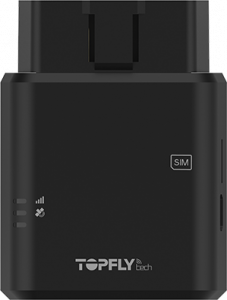

# TopFly - TLD2-L

The TopFly TLD2-L is a compact plug and play OBDII GPS tracker built for straightforward, maintenance free vehicle tracking. Designed to connect directly to a vehicle OBDII port, the device is offered as a rapid deployment option for fleets and light commercial vehicles. Its feature set focuses on frequent real time location updates, event detection for crash and aggressive driving, and support for Bluetooth Low Energy accessories to extend telemetry for sensors and control functions.

As a Plaspy compatible device, the TLD2-L integrates into Plaspy to deliver location and behavioral data into the platform for monitoring and reporting. The tracker provides GNSS positioning, cellular connectivity with fallback options, on device buffering for offline periods, and onboard event detection such as ignition alerts and disconnection notifications. These capabilities make the TLD2-L a practical choice for customers who want quick installation, ongoing remote management, and driver behavior insights exposed within Plaspy.

## Key Highlights

- Plug and play OBDII form factor for fast deployment and minimal installation effort.
- Frequent real time tracking updates with large internal storage for offline buffering.
- Cellular connectivity that supports modern low power LTE variants with legacy fallback for broad coverage.
- Integrated accelerometer based detection for harsh maneuvers and collision events to support safety programs.
- Bluetooth Low Energy support for pairing external sensors such as temperature and door contacts.
- Ignition and disconnection alerts plus backup power features to support anti theft and tamper detection.
- Firmware over the air capability for remote updates and ongoing device management.

## How It Works with Plaspy

When connected to Plaspy, the TLD2-L streams location fixes and device events to Plaspy where data is normalized, visualized, and turned into operational insights. Plaspy consumes GNSS positions, accelerometer events and paired sensor data to present live maps, behavior analytics and configurable alerts. Built in buffering and scheduled reporting help preserve data continuity through transient network gaps so fleet managers can rely on consistent histories in Plaspy.

- Continuous location and telemetry updates with configurable reporting intervals for live map views.
- Driving behavior events from onboard motion sensors for fleet safety analytics and incident review.
- Ignition status and disconnection alerts for anti theft monitoring and tamper detection workflows.
- BLE sensor data integration for temperature, humidity and door status alongside location in Plaspy.
- Scheduled reporting options to balance update frequency and data use while preserving critical events.

## Typical Use Cases

- Fleet tracking and dispatch monitoring where rapid installation and frequent location updates aid routing.
- Driver behavior programs using accelerometer events to identify harsh acceleration, braking or turns.
- Cargo condition monitoring by pairing BLE temperature and humidity sensors and logging telemetry with location.
- Anti theft and tamper response using ignition alerts and disconnection detection with backup power support.
- Rental and shared vehicle programs that benefit from a maintenance free plug and play tracker.

## Why Choose This Tracker with Plaspy

The TLD2-L offers a balance of simplicity and practical capabilities for organizations that need reliable vehicle tracking with minimal setup overhead. Its plug and play form factor and onboard event detection let teams deploy quickly and begin collecting operational telemetry without complex wiring or lengthy configuration. Paired with Plaspy, the device’s buffering, sensor integration and remote update support help maintain visibility and control across distributed fleets.

For teams evaluating GPS hardware for use with Plaspy, the TLD2-L is a useful option when quick deployment, driver behavior insights and extended telemetry via BLE sensors are priorities. Plaspy brings these device feeds into a single platform for mapping, alerts and reporting so operators can act on location and condition data with centralized oversight.

To learn more about how Plaspy works with compatible trackers like the TopFly TLD2-L visit https://www.plaspy.com. Product specifications, availability and manufacturer details can change over time so please verify current technical information on the manufacturer site https://www.topflytech.com/.
