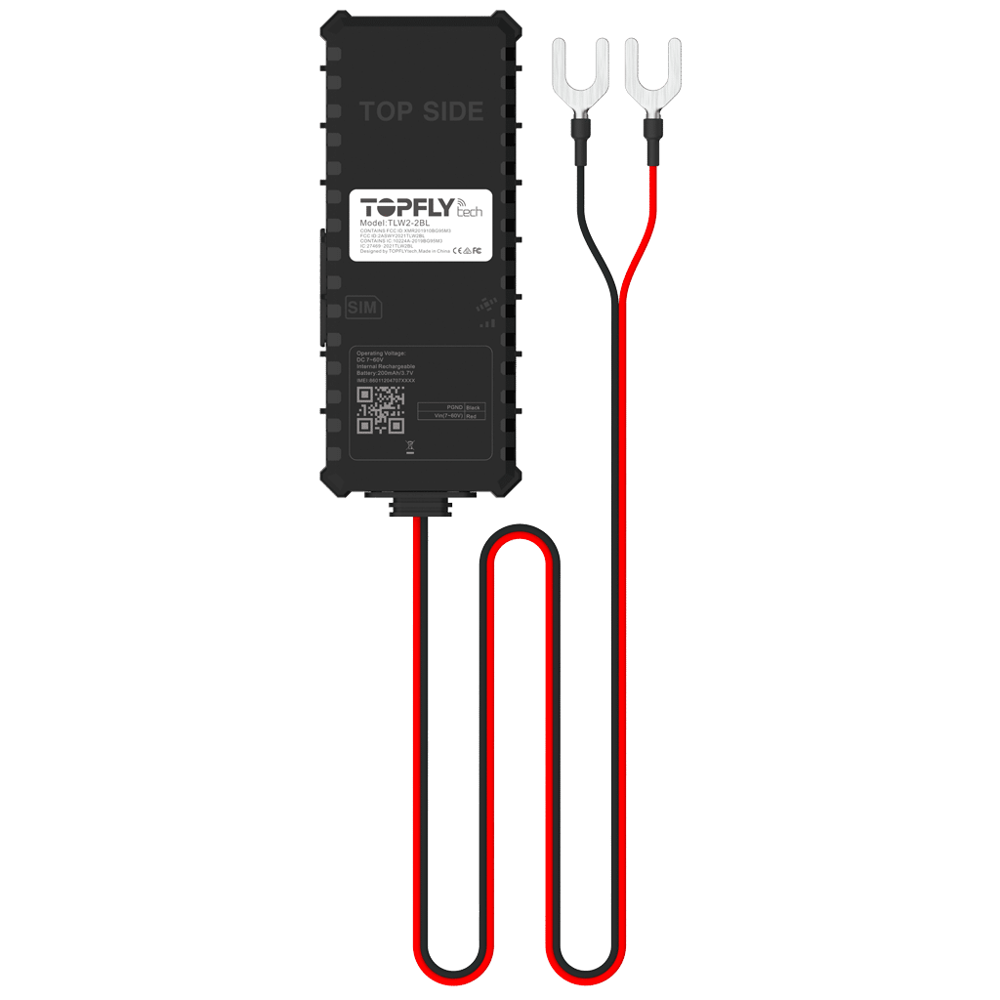

# TopFly - TLW2-2BL

The TLW2-2BL is a compact, hardwired GPS tracker built for demanding vehicle and powered asset deployments. Designed to provide frequent position updates, onboard buffering and environmental telemetry, this unit targets fleets, logistics providers and cold chain operators that need continuous visibility and dependable historical data during coverage gaps. Its small form factor and rugged rating make it suited to vehicle, trailer and equipment installations where persistent tracking and event detection are required.

As a Plaspy compatible device out of the box, the TLW2-2BL integrates with Plaspy to deliver live location, sensor telemetry and alarm events into a unified fleet management workspace. Plaspy can consume the device's high-frequency location stream, Bluetooth accessory data and event notifications to power maps, alerts and operational reports, making the tracker a practical option for teams that want reliable position and telemetry within Plaspy workflows.

## Key Highlights

- Compatible with Plaspy for immediate integration into fleet and asset monitoring workflows.
- LTE‑M connectivity with fallback options for resilient data delivery across coverage conditions.
- High-rate tracking and large onboard buffer to preserve history during temporary outages.
- BLE accessory support for temperature, humidity and door sensors useful in cold chain monitoring.
- Ignition detection and relay output support remote control and anti theft workflows.
- Compact hardwired design with rugged environmental rating for vehicle and trailer installations.

## How It Works with Plaspy

When connected to Plaspy, the TLW2-2BL streams GNSS positions, accessory sensor readings and event alerts so operators can monitor assets in real time and review historical activity. Plaspy aggregates the device telemetry and presents it in maps, dashboards and reports to support operational decisions and compliance monitoring.

- Live location updates and historical replay from buffered points to maintain continuity in tracking views.
- Sensor and alarm forwarding so temperature, door state and power events appear in Plaspy dashboards and notifications.
- Vehicle state reporting such as ignition changes and digital input events to support route and driver workflows.
- Remote control hooks using the relay output to enable immobilizer or remote action scenarios within Plaspy.
- Consolidated reporting for fleet performance, incident review and cold chain compliance across devices.

## Typical Use Cases

- Fleet management for cars, vans and service vehicles requiring frequent position updates and state events.
- Anti theft workflows using power loss, towing and remote relay control to detect and respond to unauthorized movement.
- Cold chain logistics where BLE temperature and humidity sensors feed environmental telemetry into Plaspy.
- Trailer and container monitoring where compact hardwired installation and large buffer memory preserve location history.
- Incident and post event analysis using accelerometer and event logs to reconstruct events and inform coaching.

## Why Choose This Tracker with Plaspy

The TLW2-2BL offers a practical balance of compact installation, frequent tracking updates and sensor extensibility that aligns well with Plaspy’s visibility and reporting features. Its onboard buffering and accessory support make it a sensible choice for operators who need resilience against temporary connectivity loss and want to include environmental telemetry alongside location data.

For organizations managing mixed fleets, refrigerated logistics or detachable assets, pairing the TLW2-2BL with Plaspy delivers a straightforward path to consolidated tracking, alerting and basic remote control capabilities without extensive custom integration effort.

To learn more about Plaspy and how compatible devices are used on the platform visit https://www.plaspy.com. Product specifications, availability and manufacturer details can change over time, so verify current device specifications and accessory compatibility on the manufacturer site https://www.topflytech.com/.
