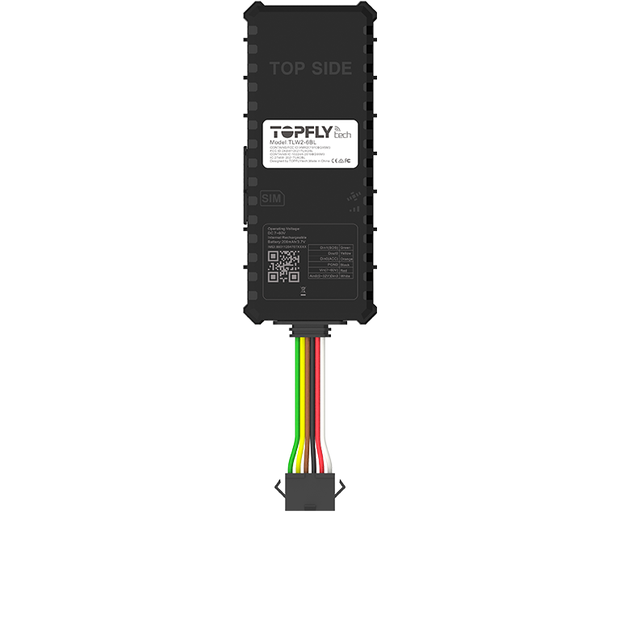

# TopFly - TLW2-6BL

The TLW2-6BL is a hardwired 4G LTE vehicle and powered asset GPS tracker designed for professional fleet management, logistics and cold chain operations. It combines resilient cellular connectivity, high precision GNSS positioning, configurable I O and Bluetooth sensor support to deliver continuous location and telemetry for vehicles and powered assets. The device is built for integrators and fleet operators who need reliable in vehicle telemetry and anti theft workflows without extensive custom integration.

As a Plaspy compatible device out of the box, the TLW2-6BL can stream position, telemetry and sensor data directly into Plaspy for live monitoring, alerts and historical reporting. Its buffering capability and vehicle oriented inputs make it well suited to Plaspy deployments that require frequent position updates, ignition based trip analytics and the ability to attach BLE sensors for temperature or door state monitoring in cold chain use cases.

## Key Highlights

- Plaspy compatible GPS tracker with resilient 4G connectivity and fallback for broad cellular coverage.
- High precision multi constellation GNSS for reliable position accuracy and fast fixes in mixed environments.
- Real time tracking with configurable high frequency reporting and large on device buffer to preserve history during outages.
- Vehicle grade I O including ignition detection and a configurable analog input to support common telemetry needs.
- Built in motion sensing and remote output control to support anti theft actions and driving behavior alerts.
- BLE 5.0 sensor support for temperature humidity and door status monitoring to extend visibility for refrigerated loads.

## How It Works with Plaspy

When connected to Plaspy the TLW2-6BL delivers continuous position and telemetry to the Plaspy platform where data is visualized, alerted on and archived for reporting and compliance. Plaspy ingests the device streams and presents them alongside other fleet assets so operators can manage vehicles, receive alarms and reconstruct routes from buffered points when connectivity returns.

- Real time location and telemetry for live fleet monitoring and accurate route playback.
- Ignition and status events to support engine on off detection and trip based analytics.
- Analog and digital input data surfaced in Plaspy for telemetry such as fuel level or other probe values.
- Remote output control to trigger immobilizer relay buzzer or other anti theft actions through Plaspy commands.
- BLE sensor readings shown in the Plaspy dashboard to support cold chain temperature and door status monitoring.
- Buffered point upload on reconnection to ensure continuous route reconstruction and historical reporting.

## Typical Use Cases

- Fleet management including live tracking ignition based trip logging and driving behavior insights.
- Anti theft and immobilization with remote relay control tamper and power loss alerts.
- Cold chain visibility using BLE temperature and humidity sensors paired with the tracker.
- Powered asset monitoring for construction equipment generators and other vehicle class assets with offline buffering.
- Logistics and route reconstruction for proof of delivery and detailed journey analysis.

## Why Choose This Tracker with Plaspy

The TLW2-6BL offers a balanced set of features that fit common Plaspy deployment needs: resilient cellular links, precise GNSS, vehicle centric I O and BLE sensor integration. For organizations that require frequent position updates, reliable offline buffering and the ability to extend telemetry with external sensors, the TLW2-6BL integrates cleanly into Plaspy workflows and scales across mixed fleets and asset types.

To learn more about how the TLW2-6BL works with Plaspy visit https://www.plaspy.com for platform details and integration options. Product specifications and availability can change over time so please verify current technical details and documentation on the manufacturer site https://www.topflytech.com/ before finalizing hardware choices.
