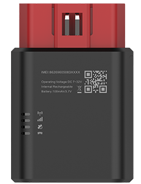

# TopFly - TorchX 100

The TorchX 100 from TopFly is a plug and play OBDII GPS tracker designed for reliable real time tracking and deep vehicle telemetry. Built for both heavy and light duty vehicles, the TorchX 100 provides frequent location updates, full CAN BUS data reading for VIN, true odometer, fuel level, ignition status and diagnostic trouble codes, and integrated ELD support for hours of service compliance. Its compact OBDII form factor and fleet grade connectivity make it suitable for a wide range of vehicle based deployments.

As a Plaspy compatible device, the TorchX 100 feeds location points, CAN telemetry and ELD records into Plaspy for reporting, alerts and operational dashboards. When paired with Plaspy, fleet managers and dispatch teams can use the device data for route visibility, compliance reporting, anti theft monitoring and passenger transport workflows, while benefiting from Plaspy's centralized monitoring and alerting capabilities.

## Key Highlights

- Plug and play OBDII form factor with full CAN BUS reading for VIN true odometer fuel level ignition status and DTCs
- Plaspy compatible for real time tracking scheduled reporting and centralized fleet management
- Global 4G LTE Cat 4 connectivity with automatic fallback and local buffering of up to 49 000 location points
- Built in dual band WiFi hotspot to support passenger internet and additional onboard services
- ELD functionality for driver hours of service records and integration into compliance reports
- Advanced telemetry features including driving behavior detection network jamming alerts and robust local data buffering

## How It Works with Plaspy

The TorchX 100 transmits vehicle location ELD logs and CAN BUS telemetry to Plaspy where the data is ingested into dashboards reports and alert workflows. Plaspy consolidates real time updates historical traces and diagnostic events so fleet operators can monitor vehicles continuously and run compliance or maintenance reports.

- Real time location and telemetry updates configurable and capable of frequent reporting with automatic buffering when coverage is lost
- Ignition on and off alerts VIN and true odometer reporting for accurate asset identification and ignition based workflows
- Fuel level monitoring and DTC reporting via CAN BUS to support maintenance planning and fuel oversight
- ELD logs for driver hours of service visible in Plaspy reports and compliance workflows
- Device health status and WiFi hotspot state reported for operational visibility and remote troubleshooting

## Typical Use Cases

- Fleet management for route visibility fuel monitoring odometer tracking and driver behavior analysis
- Passenger transport and shuttle services benefiting from frequent location updates and onboard WiFi
- Car rental and shared mobility for VIN and odometer verification plus anti theft monitoring
- Regulatory compliance where ELD records and driver hours are required for audits and reporting
- Vehicle diagnostics and preventive maintenance using DTC reporting and telemetry driven alerts

## Why Choose This Tracker with Plaspy

The TorchX 100 combines compact OBDII convenience with fleet grade telemetry and ELD features that make it a practical choice for organizations using Plaspy. Its comprehensive CAN BUS readings and frequent location updates provide the data Plaspy needs to deliver accurate tracking reports and compliance records without adding complex hardware to each vehicle.

Paired with Plaspy, the TorchX 100 supports operational oversight through configurable alerts buffered offline reporting and consolidated dashboards for drivers managers and maintenance teams. For fleets seeking a plug and play device that extends beyond basic location tracking to include diagnostics passenger services and hours of service logging, this model is a fit worth considering.

Learn more about Plaspy on the main website https://www.plaspy.com. Product specifications availability and manufacturer details can change over time so please verify current specifications on the official TopFly site https://www.topflytech.com/ before making procurement or deployment decisions.
