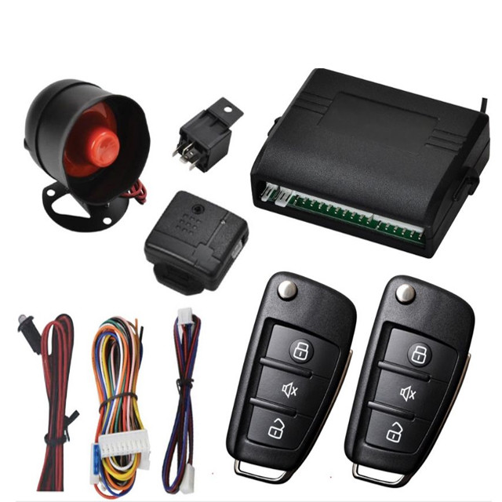

# TopShine - 2FD-100

The 2FD-100 is a two-way OBD2 GPS tracker and smart 4G car alarm designed for professional vehicle security and connectivity. Engineered as an integrated solution, it combines GPS/GSM positioning, vehicle alarm inputs/outputs, a mobile WiFi hotspot and two-way voice communication to deliver real-time tracking and robust anti-theft protection. Built from industrial-grade components with an independent GSM/GPS module and legal IMEI, the 2FD-100 is ready for fleet deployments and demanding vehicle installations.

The 2FD-100 is Plaspy compatible and works with vehicle management platforms to provide real-time tracking, telemetry and remote control. Out of the box it includes free lifetime access to TopShine’s tracking platform \(PC and Android\) while offering configuration options for third‑party systems such as Plaspy. This makes it ideal for fleet management, rental and leasing, passenger vehicles requiring WiFi, and any use case where remote immobilization, alarm monitoring and rich telemetry are required.

## Key Highlights

- Plaspy compatible GPS tracker providing real-time tracking and position updates for fleet management and asset visibility.
- Integrated 4G connectivity plus WiFi hotspot to support passenger internet access and remote monitoring of multiple IP cameras \(20+\).
- Two-way voice and remote control: remote lock/unlock, trunk release, ignition control and optional engine cut-off \(immobilizer\) via app, web, SMS or remote controller.
- Comprehensive anti-theft and alarm features: crash alarm, overspeed alarm, geofence alerts, movement detection and optional SOS panic button.
- Industrial-grade design with external GSM antenna support, anti-jamming features and a legal IMEI GSM/GPS module for reliable telemetry.
- Expandable with optional accessories: siren, shake sensor, crash sensor, ultrasonic/cutable fuel sensors and internal battery options for customized fuel monitoring and backup.
- Includes free TopShine tracking platform access and supports standard car alarm systems and remote controllers for fast deployment.

## How It Works with Plaspy

When configured for Plaspy, the 2FD-100 streams GPS positions and vehicle telemetry to Plaspy’s servers using its 4G/GSM connection. Plaspy receives periodic location updates, alarms and digital input states, and allows fleet managers to view live positions, playback routes and trigger alerts. Remote commands \(lock/unlock, trunk release, ignition control or engine cut-off where enabled\) can be sent from the Plaspy interface back to the device to manage vehicles in real time.

- Real-time location and telemetry updates \(GPS/GSM\) for live tracking and historical playback.
- Alarm and status events: crash alarm, overspeed, geofence, movement detection and SOS alerts.
- Ignition and remote control: ignition status reporting and remote engine cut-off/immobilizer where the optional function is enabled.
- Fuel monitoring: supports ultrasonic/cutable fuel sensors as optional accessories for fuel-level telemetry integration.
- WiFi camera monitoring and two-way audio: supports remote real-time monitoring of multiple WiFi cameras and two-way voice when camera hardware includes microphone/speaker.
- Remote management: platform control via app, web, SMS or remote controller for commands and firmware/configuration management where supported.

## Technical Overview

| Connectivity | 4G \(smart 4G car alarm\), GSM/GPS module; integrated WiFi hotspot for cameras and passenger access |
| --- | --- |
| Bands | Not specified / model-dependent |
| Power & Battery | Working voltage 9VDC–24VDC \(rated: DC12V ±10%\); optional built-in battery available |
| Interfaces | OBD2 / wiring harness options; ignition input, remote lock/unlock, trunk release, siren output, relay included; compatible with standard car alarm systems and remote controllers; optional engine cut-off \(immobilizer\) |
| GNSS | Independent GPS/GSM module; GPS positioning and telemetry reporting |
| Bluetooth | Not specified. Device supports a range of wired and wireless accessories; for Bluetooth sensors, verify compatibility before purchase. |
| Remote Management | TopShine free tracking platform \(PC: www.track-car.com; Mobile: http://www.track-car.com/M\), app, web platform, SMS and remote controller support |
| Mechanical / Electrical | Housed in ABS; static current ~1.5A ±5%; locked-rotor current 4–5A; loading current 2.5A ±5%; push/pull force ≥3.5KG; operation stroke 18mm ±1; active time 0.26–0.48s |
| Form Factor | Two-way OBD2 GPS tracking device / integrated vehicle alarm unit with wiring harness, siren and sensors \(standard package\) |
| Certifications & Warranty | CE / RoHS / SGS certified; two-year warranty |

## Use Cases

- Fleet management: monitor vehicle locations, routes, driver behavior and telemetry for efficient dispatch and maintenance planning.
- Anti-theft protection and immobilization: remote lock/unlock and optional engine cut-off to secure stolen or misused vehicles in real time.
- Passenger vehicles and VIP transport: provide in-vehicle WiFi and camera monitoring with two-way audio for safety and comfort.
- Fuel monitoring and cost control: integrate optional ultrasonic/cutable fuel sensors to track consumption and detect theft.
- Rental and leasing operations: geofence alerts, crash and SOS alarms, and remote control features to protect assets and respond quickly to incidents.

## Why Choose This Tracker with Plaspy

The 2FD-100 combines proven vehicle alarm hardware with modern connectivity to deliver reliable real-time tracking and telemetry for managers who need visibility and control. Its compatibility with Plaspy \(in addition to the included TopShine platform\) means you can integrate vehicle data into your preferred workflows for fleet management, reporting and alerting. Industrial-grade components, external antenna support and a lawful IMEI GSM/GPS module reduce downtime and improve signal reliability, while the range of alarm inputs, outputs and optional sensors makes the unit adaptable to specific anti-theft, fuel monitoring and immobilizer requirements.

For organizations that need scalable tracking, the 2FD-100 offers the flexibility to deploy across mixed fleets, connect IP cameras for live monitoring, and issue remote immobilization commands when necessary. If Bluetooth sensors are required in your fleet architecture, confirm compatibility with your Plaspy instance and the tracker’s accessory list to ensure full telemetry integration. With included software access, certified components and a two-year warranty, the 2FD-100 is positioned as a practical GPS tracker for Plaspy-compatible vehicle security and fleet management solutions.

