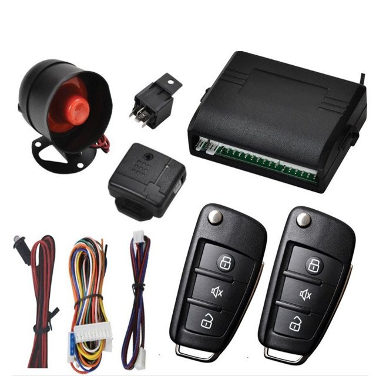

# TopShine - CA02

# CA02 GSM Siren Car Security Alarm System

The CA02 is a Plaspy compatible GPS tracker and car security alarm designed for in-dash installation \(1DIN or 2DIN\). This 3-in-1 system combines an audible siren with a shock sensor, real-time GPS tracker, and central locking control to deliver reliable anti-theft protection and continuous vehicle monitoring. With 2G GSM connectivity and free web/mobile tracking, the CA02 makes it straightforward to add dependable real-time tracking and remote immobilizer functionality to passenger cars and light commercial vehicles.

Built for fleet management and individual vehicle security, the CA02 provides immediate alarm response, SMS alerts, geofence and overspeed notifications, and relay-driven engine/oil cut-off for immobilization when GSM jamming or theft is detected. Its industrial-grade GSM/GPS modules, legal IMEI code and a two-year warranty make it a practical choice for installers and operators seeking proven telemetry and security features integrated with the Plaspy platform.

## Key Highlights

- Plaspy compatible GPS tracker: real-time tracking and historical route playback via web and iOS/Android apps.
- Integrated siren and shock sensor for immediate audible alerts on impact or tampering.
- Central locking control and trunk open commands from remote, SMS, app or platform — convenient and secure.
- GSM jamming detection with relay-triggered engine/oil cut-off for robust anti-theft immobilizer capability.
- Movement, geofence, overspeed and illegal door-open alarms to support fleet safety and compliance.
- Optional expansions such as fuel monitoring and external microphone for advanced telemetry and security use cases.
- Compact in-dash form factor \(1DIN/2DIN\) with industrial-grade modules and a 2-year warranty for long-term deployment.

## How It Works with Plaspy

The CA02 communicates position and alarm telemetry over 2G GSM to Plaspy’s tracking infrastructure, enabling real-time tracking, alerting and remote control from the Plaspy dashboard or mobile apps. When the unit reports events \(shock sensor trigger, door open, movement, overspeed or geofence breach\), Plaspy receives those telemetry updates and can present instant notifications, route history and status information to fleet managers or vehicle owners.

- Real-time location and telemetry updates delivered over 2G GSM to Plaspy for live vehicle monitoring.
- Alarm and status reporting — shock sensor alerts, illegal door-open and movement events are forwarded to Plaspy.
- Optional telemetry such as fuel monitoring can be integrated when the expansion modules are present, allowing Plaspy to show fuel data alongside GPS tracks.
- Remote immobilizer and engine cut-off commands sent from Plaspy or via SMS/platform controls to the CA02 relay-controlled outputs.
- Plaspy can complement CA02 data with additional sensors \(for example, Bluetooth sensors supported by Plaspy\) to expand telemetry without implying native BLE support on the CA02 itself.

## Technical Overview

| Connectivity | 2G GSM \(2G SIM card required\) |
| --- | --- |
| Bands | 2G GSM — specific frequency bands not specified by manufacturer |
| Power & Electrical | Rated Voltage: DC 12V ±10%; Static Current: 1.5A ±5%; Loading Current: 2.5A ±5%; Locked-rotor Current: 4–5A |
| Interfaces & Controls | Built-in siren and shock sensor; central locking control; relay outputs for engine/oil cut-off and trunk control; SMS/app/platform command support; GSM jamming detection; optional SOS and microphone expansions |
| GNSS | Real-time GPS tracking \(GNSS accuracy unspecified\) |
| Bluetooth | Not specified for the CA02 \(Plaspy platform supports BLE sensor integration separately\) |
| Remote Management | Free web-based tracking platform and iOS/Android apps; device accepts commands via platform and SMS |
| Form Factor | In-dash installation: 1DIN or 2DIN; ABS shell; unit weight ~1 kg; dimensions ~12 × 8 × 3.5 cm |
| Warranty | 2 years |

## Use Cases

- Fleet anti-theft and immobilization — use Plaspy to monitor vehicle locations and trigger remote engine cut-off on confirmed theft events.
- Real-time driver and vehicle monitoring — overspeed alerts, route playback and movement notifications for better fleet management.
- Parked vehicle protection — shock sensor and siren activation combined with geofence and door-open alerts to deter tampering.
- Secure access and convenience — central locking and trunk open control from Plaspy or a smartphone app for remote operations.
- Advanced telemetry deployments — add optional fuel monitoring or microphone expansion modules where fuel data or in-cab audio monitoring is required.

## Why Choose This Tracker with Plaspy

Choosing the CA02 with Plaspy delivers a practical balance of anti-theft security, real-time tracking and fleet-focused telemetry in a single in-dash unit. Its integrated siren and shock sensor provide immediate audible deterrence, while telemetric alarms and geofence/overspeed reporting feed directly into Plaspy for centralized visibility. The relay-based immobilizer and GSM jamming detection add an important layer of vehicle protection for high-risk scenarios.

For fleet managers and vehicle owners, the CA02 supports common operational needs — remote engine cut-off, central locking control, and optional fuel monitoring — and pairs with Plaspy’s web and mobile apps to turn raw GPS and alarm data into actionable insights. Backed by industrial-grade components and a two-year warranty, the CA02 is a trustworthy option when you need Plaspy compatible real-time tracking, anti-theft protection, and a compact in-dash installation.

