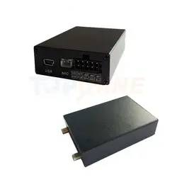

# TopShine - GT103

The TopShine GT103 Anti Theft GPS Vehicle Tracker is a compact, cost effective unit designed for cars, trucks, buses and fleet management. It combines real time GPS positioning with vehicle security features such as smart RFID driver identification, a built in SOS panic button, and a remote engine cut off relay to support anti theft and operational control. The device includes two way voice capability, ACC detection for ignition status, geo fence and over speed alarms, and is delivered with certified compliance and a legal IMEI for commercial use.

As a Plaspy compatible device, the GT103 can feed location and security telemetry directly into Plaspy for unified monitoring and management. Plaspy ingests the tracker data so fleet managers and security teams can view live positions, receive alarms, review historical tracks and trigger remote responses from a single platform. The GT103’s combination of vehicle focused inputs and anti theft controls makes it a practical option for organizations that want secure, visible fleet operations through Plaspy.

## Key Highlights

- Plaspy compatible GPS tracker providing real time tracking and vehicle telemetry for web and mobile access
- Anti theft features including smart RFID driver ID and remote engine cut off relay for secure vehicle control
- Built in SOS panic button and two way voice to support incident response and driver communication
- Standard fleet alarms such as geo fence notifications, over speed alerts and ACC ignition detection
- Compact, rugged design with backup battery and a wide operating temperature range suitable for vehicle use
- Fast GNSS positioning using a u blox7 based receiver for dependable location updates
- Certified hardware with FCC CE and RoHS markings and a legal IMEI for commercial deployments

## How It Works with Plaspy

When integrated with Plaspy, the GT103 transmits location and status updates to Plaspy’s servers where data is presented in dashboards, live maps and reports. Plaspy centralizes the device telemetry and provides notification rules, historical playback and control workflows so teams can act on alarms and review activity across a fleet.

- Real time location and telemetry displayed on Plaspy maps and device lists
- ACC ignition status and motion events used for engine on off reporting and operational analysis
- SOS and geo fence alarms delivered as immediate notifications to assigned users and administrators
- Remote immobilizer control supported via commands sent through the connectivity channels when enabled
- Two way voice and recorded incident information available to support event verification within Plaspy workflows
- External sensor and telemetry consolidation possible in Plaspy when supplementary sensors are integrated

## Typical Use Cases

- Commercial fleet tracking for route oversight, speed alerts and ignition logging
- Vehicle anti theft protection using RFID identification, SOS alerts and remote immobilization
- Asset monitoring for trailers or equipment that require discreet movement detection and response
- Driver safety management with two way voice and panic button support for rapid assistance
- Compliance and logistics oversight using geo fence enforcement and historical reporting

## Why Choose This Tracker with Plaspy

The GT103 pairs practical anti theft controls and fleet focused telemetry with Plaspy’s monitoring and management tools to provide a single view of vehicle activity and security events. Its certified hardware and legal IMEI make it suitable for organized fleet rollouts while the device features support common operational requirements such as driver ID, SOS alerts and immobilization.

If you want a cost effective tracker that brings vehicle security and fleet visibility into Plaspy, the GT103 is a solid candidate to consider alongside your deployment criteria. Learn more about Plaspy on the main website https://www.plaspy.com. Product specifications, availability and manufacturer details can change over time, so please verify current specifications and certifications on the official TopShine site https://www.gztopshine.com/ before purchase.
