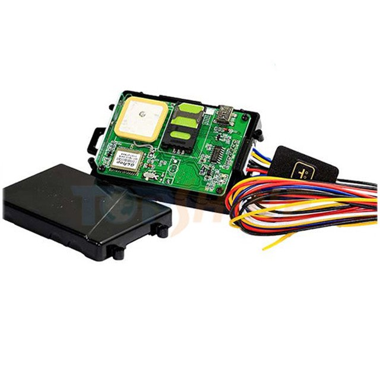

# TopShine - MT01-4G

The TopShine MT01-4G is a compact vehicle GPS tracker designed for modern fleet management, taxi dispatch and anti theft workflows. Built with 4G LTE connectivity, ultrasonic fuel sensor support and relay control for remote engine or fuel cut off, the MT01-4G provides continuous location tracking and vehicle telemetry suitable for a wide range of vehicle types. Its driver identification via iButton and two way voice capability make it practical for operations that need driver authentication and direct dispatcher communication.

As a Plaspy compatible device, the MT01-4G can feed location updates, fuel level data, engine and ignition status, and alarm events into Plaspy dashboards and reporting tools. That compatibility allows fleet and operations teams to consolidate telemetry from this tracker alongside other devices in Plaspy, enabling unified visibility, alerts and historical reporting without changing the device hardware already in use.

## Key Highlights

- 4G LTE connectivity for timely real time position updates and alerts.
- Ultrasonic fuel sensor support for continuous fuel level monitoring and fuel theft detection.
- Relay output for remote immobilizer or engine fuel cut off to assist recovery and theft response.
- Driver identification with iButton reader to link drivers to vehicle events and logs.
- Two way voice with speaker and microphone to support dispatcher communication.
- Wide 9–90V operating range and built in backup battery for multi vehicle compatibility and power loss alerts.
- On board data logger for offline storage and automatic upload when connectivity returns.

## How It Works with Plaspy

When integrated with Plaspy, the MT01-4G transmits standard positioning and vehicle telemetry to the platform so operators can monitor assets in real time and review historical activity. Plaspy receives the unit data and exposes it through maps, alerts and reports to support daily fleet operations and exception handling.

- Real time location and movement updates appear on Plaspy maps for live fleet visibility.
- Fuel level readings and fuel theft alerts are ingested into Plaspy for trend analysis and reporting.
- Engine and ignition events plus immobilizer status are available to Plaspy to drive alerts and operational workflows.
- Driver iButton events are recorded in Plaspy to associate trips and events with personnel.
- Alarm messages and offline logged data are uploaded to Plaspy and shown in incident timelines for post event review.

## Typical Use Cases

- Fleet management for mixed vehicle fleets where real time tracking and fuel monitoring reduce operating costs.
- Taxi and ride hail operations requiring driver identification and two way voice coordination for dispatch.
- Theft prevention and recovery workflows using fuel theft detection, panic alerts and remote immobilization.
- Mixed asset deployments including cars, trucks, motorcycles and small vessels that benefit from a wide input voltage range.
- Maintenance and incident investigation where offline logging and crash or power loss alerts support analysis.

## Why Choose This Tracker with Plaspy

The TopShine MT01-4G offers a pragmatic set of vehicle telematics features that align with common fleet needs such as fuel monitoring, driver identification and anti theft controls. Its combination of wide voltage support, backup power and onboard logging makes it a flexible option across diverse vehicle types, reducing the need for multiple device variants when managing mixed fleets.

Paired with Plaspy, the MT01-4G becomes part of a unified fleet platform where telemetry, alerts and historical reports are available in one place. This setup helps operations teams turn device data into actionable insights for routing, fuel control and asset protection while keeping device onboarding and monitoring straightforward.

To learn more about Plaspy and how compatible devices like the MT01-4G integrate into fleet workflows visit https://www.plaspy.com. Product specifications and availability can change over time, so please verify current device details and technical specifications on the manufacturer site https://www.gztopshine.com/ for the most up to date information.
