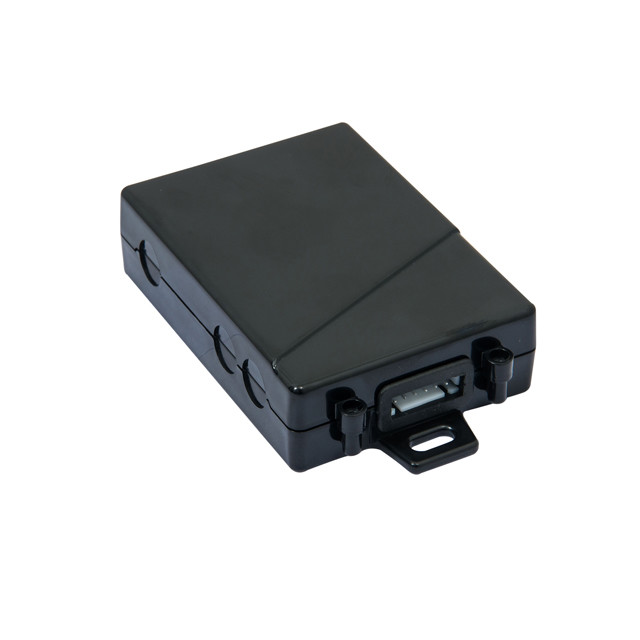

# TopShine - MT01W-4G

The MT01W-4G is a compact, Plaspy compatible GPS tracker engineered for fleet management, passenger vehicles and security-conscious operators who need integrated video, telemetry and reliable real-time tracking. Built around 4G CAT1 connectivity and a built‑in WiFi hotspot, the MT01W-4G combines vehicle location, event alerts and in-vehicle video monitoring into one concealed, waterproof unit for straightforward deployment across mixed fleets.

Designed for operators who want video-enabled fleet tracking and anti-theft functionality without multiple devices, the MT01W-4G supports live streaming from multiple WiFi cameras, onboard SD recording, and a robust set of telemetry and safety alerts. When paired with Plaspy, this tracker delivers actionable location data, driver and engine status, and remote immobilization options to improve security, efficiency and compliance.

## Key Highlights

- Plaspy compatible GPS tracker with 4G CAT1 connectivity for reliable real-time tracking and low-latency telemetry.
- Built-in WiFi hotspot supporting 20+ WiFi cameras for live video monitoring and multi-camera fleet surveillance.
- Integrated video recorder with SD card storage and live streaming — ideal for driver monitoring and incident review.
- Wide power input \(9V–90V\) and a 500 mAh internal backup battery for uninterrupted operation during power loss.
- Vehicle security features: SOS panic, crash alert, geo-fence, over-speed and theft/refill alerts to support anti-theft workflows.
- Remote engine cut-off via relay for secure immobilizer control when combined with Plaspy remote commands.
- Driver identification support \(iButton or passive RFID\) and optional two-way voice \(speaker & microphone\) for driver authentication and communication.
- Compact, mini-size waterproof design for discreet installation and long-term field durability.

## How It Works with Plaspy

When integrated with Plaspy, the MT01W-4G streams location and event data to your Plaspy dashboard in near real time, enabling centralized fleet management and rapid incident response. Plaspy ingests the tracker’s GPS positions, telemetry and alarms, and maps video streams from connected WiFi cameras for synchronized situational awareness. Alerts and reports from the device are translated into Plaspy notifications, enabling automated workflows such as immobilization, driver alerts and maintenance scheduling.

- Real-time location and telemetry updates sent over 4G CAT1 to Plaspy for live tracking and historical playback.
- Driver identification events \(iButton/RFID\) logged to the platform to associate trips with personnel and improve accountability.
- Fuel monitoring alerts \(fuel theft/refill\) supported when paired with optional ultrasonic or cuttable fuel sensors; events reported to Plaspy for fuel analytics.
- Remote immobilizer/engine cut-off via relay — Plaspy can trigger secure engine disable commands where business rules require immobilization.
- Video integration: WiFi camera streams and SD card recordings are accessible alongside GPS traces in Plaspy for incident verification and driver coaching.

## Technical Overview

| Connectivity | 4G CAT1 cellular; built-in WiFi hotspot for camera connections and passenger internet access |
| --- | --- |
| Bands | Not specified by vendor |
| Power & Battery | Wide input 9V–90V; internal 500 mAh backup battery for power-loss operation |
| Interfaces | 4-pin wiring harness; 12V/24V relay included for remote engine cut-off; supports optional speaker & microphone; driver ID via iButton or passive RFID readers |
| GNSS | GPS tracker with onboard 2MB data logger to record positions in GSM/GPRS blind areas \(specific GNSS bands/accuracy not specified\) |
| Bluetooth | Not specified |
| Remote Management | OTA firmware upgrades; customizable MQTT protocol supported; vendor provides web platform and iOS/Android apps |
| Form Factor | Mini-size, waterproof design for concealed installation; compact unit weight ~0.2 kg |

## Use Cases

- Fleet management: real-time tracking, driver identification and telemetry feed into Plaspy for route optimization and operational reports.
- Anti-theft and remote immobilization: SOS, crash alerts and relay-based engine cut-off help secure high-value vehicles and enable rapid response.
- In-vehicle video monitoring: multi-camera WiFi support and SD recording capture incidents, passenger events and on-route behavior for compliance and claims reduction.
- Fuel monitoring and theft detection: integrate optional ultrasonic or cuttable fuel sensors to report refill/theft events to Plaspy for fuel consumption analysis.
- Passenger and driver communication: optional two-way voice and hotspot capabilities provide in-vehicle connectivity and on-demand communication.

## Why Choose This Tracker with Plaspy

The MT01W-4G brings video-capable GPS tracking, robust telemetry and vehicle security into a single Plaspy compatible device, reducing integration complexity and lowering hardware count per vehicle. Its wide voltage support and internal backup battery ensure continuous reporting for mixed fleet applications, while OTA updates and MQTT flexibility simplify long-term maintenance and platform integration. For fleet operators focused on real-time tracking, anti-theft protection, fuel monitoring and synchronized video evidence, pairing the MT01W-4G with Plaspy delivers a scalable, reliable solution that makes telematics, driver oversight and immobilizer control straightforward and centrally manageable.

