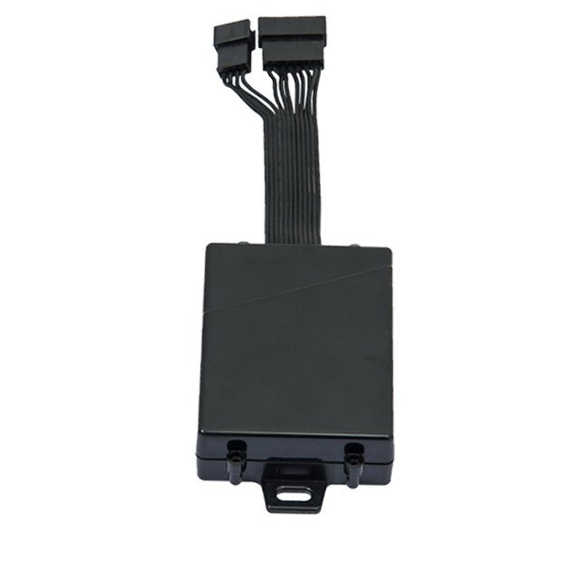

# TopShine - MT02

The TopShine MT02 is a professional grade GPS tracker designed for vehicle installations. It combines 4G LTE cellular connectivity, GPS with assisted positioning, onboard data logging and fuel sensor integration to deliver continuous telemetry, configurable alerts and remote immobilization capabilities. The device is positioned for fleet use, offering features that support reliable tracking, historical recording and anti theft protection.

As a Plaspy compatible device, the MT02 can stream position and telemetry into the Plaspy platform where operators gain map based visibility, event notifications and reporting. Its combination of reporting options, offline logging and remote control functions makes it well suited to integrate into Plaspy deployments for fleet monitoring, fuel oversight and rapid incident response.

## Key Highlights

- Designed for professional vehicle use with 4G LTE connectivity and fallback reporting options for broad coverage.
- Integrated fuel sensor support to detect refills and potential fuel loss events for better cost control.
- Onboard data logging to retain GPS and event history during connectivity outages and upload when restored.
- Remote immobilize relay control and SOS button support for anti theft workflows and driver safety alerts.
- Wide input voltage range and backup power capability to maintain reporting after main power loss.
- IP65 level dust and water resistance for durable operation in typical vehicle environments.

## How It Works with Plaspy

When connected to Plaspy, the MT02 sends regular position and telemetry updates that Plaspy ingests for visualization, alerting and historical analysis. Plaspy users can view live location on maps, receive configured alarms and produce reports from the device data. The platform also supports issuing remote commands to adjust behavior and respond to incidents reported by the tracker.

- Real time location and telemetry feed into Plaspy for map visualization and operational oversight.
- Fuel level data and related alarms are delivered to Plaspy so teams can monitor consumption and detect refill or theft events.
- SOS, geofence, overspeed and tamper alerts route to Plaspy for immediate notification and incident tracking.
- Remote immobilize control can be issued from Plaspy to support anti theft responses when authorized.
- Stored records from onboard memory upload to Plaspy after connectivity restoration, preserving route history and events.

## Typical Use Cases

- Fleet management for cars, vans and trucks requiring continuous location tracking and route history.
- Anti theft protection using SOS alerts, tamper detection and remote immobilization for stolen vehicle response.
- Fuel monitoring programs that integrate external sensors to detect refills and unauthorized fuel loss.
- Driver safety and dispatch operations using alerts for overspeed events and geofence breaches.
- Service and delivery fleets that need offline logging and reliable telemetry in variable coverage areas.

## Why Choose This Tracker with Plaspy

The MT02 offers a focused feature set that aligns with common fleet and vehicle security requirements. Its support for fuel monitoring, remote immobilization and onboard logging addresses practical operational needs while its rugged design helps ensure dependable field performance. For organizations using Plaspy, the MT02 can be a single device to capture location, fuel data and event alarms without adding complexity.

Plaspy can combine MT02 telemetry with platform capabilities such as maps, alerts and reporting to provide a cohesive operational view. If you want to learn more about how Plaspy works with compatible trackers and how the MT02 can fit into your deployment, visit https://www.plaspy.com. Product specifications and availability can change over time, so please verify the current technical details on the manufacturer site https://www.gztopshine.com/.
