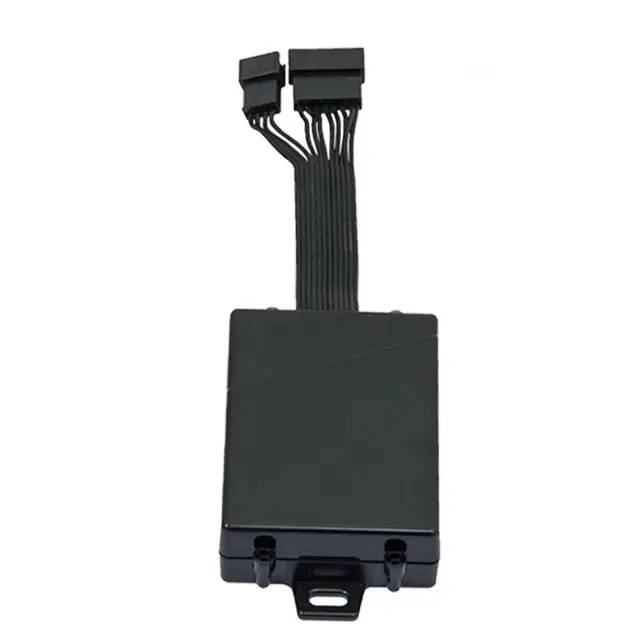

# TopShine - MT02-4G

The MT02-4G is a compact 4G vehicle GPS tracker designed for fleet management, anti theft protection and general vehicle telemetry. It provides continuous location reporting, onboard data logging and support for accessory based features such as fuel monitoring and remote immobilization. The device is packaged for use on cars, trucks and motorcycles where reliable tracking and event capture are required.

This model is Plaspy compatible out of the box, allowing it to integrate with Plaspy dashboards and mobile interfaces for real time tracking, historical route playback and configurable alerts. Built in offline logging and remote firmware management help operations teams maintain visibility and reduce service intervention while keeping tracked data accessible inside Plaspy for reporting and operational oversight.

## Key Highlights

- Native compatibility with Plaspy for live location and fleet management
- 4G cellular connectivity for reliable real time tracking
- Built in 2MB data logger storing approximately 26,000 points and expandable memory options
- Wide input voltage range for use across cars trucks and motorcycles
- 500mAh backup battery to capture location when main power is interrupted
- OTA firmware upgrade capability to simplify maintenance and updates
- Accessory support for fuel monitoring driver identification and remote immobilizer control

## How It Works with Plaspy

When connected to Plaspy the MT02-4G sends location and vehicle status to the Plaspy platform so fleet managers can view live positions and event history. Plaspy ingests the device data and presents it through map views timelines and alerting tools to support operational decision making.

- Real time location updates and live position tracking inside Plaspy
- Historical route playback and stored point review from onboard logger
- Configurable alerts for events such as geofence triggers SOS and power loss
- Offline logging automatic upload of stored points when network is restored
- Remote firmware updates and device lifecycle actions coordinated alongside Plaspy device management
- Integration of accessory events such as fuel sensor readings driver ID and immobilizer actions into platform alerts and reports

## Typical Use Cases

- Commercial fleet tracking for route visibility mileage monitoring and utilization reporting
- Anti theft and recovery workflows using immobilizer controls alerts and geofence rules
- Fuel monitoring and consumption oversight when auxiliary sensors are installed
- Driver identification and safety monitoring for compliance and coaching
- Vehicle tracking for cars motorcycles and mixed fleet assets with wide voltage support

## Why Choose This Tracker with Plaspy

The MT02-4G offers a balanced set of features for organizations that need dependable position reporting plus resilient data capture when connectivity or power is interrupted. Its combination of real time 4G reporting, onboard logging and remote update capability makes it a practical option for distributed fleets that rely on Plaspy for monitoring and reporting.

If you are evaluating Plaspy compatible hardware the MT02-4G is worth considering for straightforward integration into Plaspy dashboards and alerting workflows. To learn more about Plaspy visit https://www.plaspy.com and for the most current product specifications and manufacturer details verify information on the TopShine website https://www.gztopshine.com/. Product specifications availability and accessory options can change over time so check the manufacturer documentation for the latest details.
