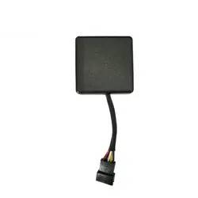

# TopShine - MT06

The MT06 is a compact, IMEI registered GPS tracker designed for motorcycles and small vehicles. It combines integrated GPS and GSM antennas in a waterproof mini housing and uses a low power design to reduce data consumption while maintaining continuous position and status reporting. Certified to CE FCC and RoHS standards, the unit is built for concealment and durability in commercial fleet and anti theft deployments.

As a fully Plaspy compatible device, the MT06 can be deployed quickly into an existing Plaspy tracking stack to provide live location, speed and status updates. Its support for relay based engine cut off, geo fencing, over speed alarms and SMS location replies with Google Map links makes it a practical choice for operators who need actionable telemetry and rapid incident response alongside Plaspy monitoring and reporting.

## Key Highlights

- Plaspy compatible real time tracking for live position and status integration
- Compact waterproof form factor with integrated antennas for discreet installs
- IMEI registration plus CE FCC and RoHS certifications for commercial use
- Low power design that helps reduce GPRS data consumption and operating cost
- Remote immobilizer support via relay for anti theft intervention
- Built in geo fence and over speed alarms with SMS location replies and map links

## How It Works with Plaspy

When connected to Plaspy the MT06 sends location fixes movement telemetry and alarm events over its cellular data or SMS channels. Plaspy ingests those messages to deliver live maps historical playback notifications and fleet reports so teams can monitor vehicles and respond to incidents in near real time.

- Real time location and telemetry updates flow into Plaspy dashboards for live monitoring
- Geo fence breaches and over speed events are delivered as alarms for instant notification
- Remote immobilizer commands coordinated through Plaspy workflows enable rapid intervention
- Historical route playback and odometer summaries support operational review and reporting
- SMS location replies with Google Map links provide a fallback when data connectivity is limited

## Typical Use Cases

- Motorcycle anti theft and rapid recovery using discreet mounting and immobilizer control
- Small fleet tracking for route oversight compliance and driver monitoring
- Delivery and last mile operations where compact form factor and event logging matter
- Rental and shared vehicles combining real time tracking with immobilizer control
- Maintenance and tamper detection using external power cut alerts and mileage reporting

## Why Choose This Tracker with Plaspy

The MT06 pairs a purpose built motorcycle and small vehicle tracker with Plaspy compatible data flows to deliver dependable low cost real time tracking and basic immobilizer control. Its waterproof compact housing and concealed antennas suit discreet installations while the low power design reduces ongoing data expenses for sustained fleet telemetry.

If you need a compact tracker that integrates into Plaspy for fleet monitoring anti theft protection and simple operational reporting the MT06 is a practical option to evaluate. Learn more about Plaspy on the main website https://www.plaspy.com and verify current product specifications availability and manufacturer details at the official TopShine site https://www.gztopshine.com/ since product features and offerings can change over time.
