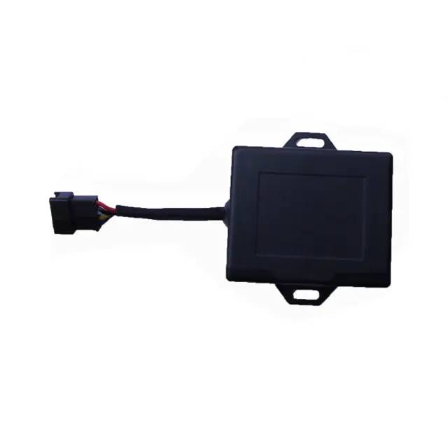

# TopShine - MT08

The MT08 Mini Motorcycle 4G GPS Tracker is a compact, waterproof tracking unit designed for motorcycles, scooters and small vehicles. It combines cellular connectivity and a built in Bluetooth module with a small form factor optimized for concealed under seat placement, delivering location, status and alarm reporting suitable for fleet managers and individual riders.

As a Plaspy compatible device out of the box, the MT08 can deliver real time position updates, alerts and basic telemetry into Plaspy’s dashboard and reporting tools. Its combination of wide input voltage tolerance, multiple reporting channels, and optional accessories makes it a practical option when integrating two wheel assets into Plaspy for tracking, security and operational oversight.

## Key Highlights

- Ready for Plaspy integration for live tracking and event reporting.
- Compact waterproof housing suited to concealed under seat installation on motorcycles and scooters.
- 4G and 2G cellular connectivity with SMS and GPRS fallback for consistent data delivery.
- Built in Bluetooth for smart alarm functions and optional driver identification.
- Wide operating input voltage range to support a broad set of two wheel and small vehicle electrical systems.
- Movement, geo fence, SOS and power failure alerts help protect vehicles and trigger notifications.
- Support for optional fuel sensing and remote listening accessories to expand telemetry capabilities.

## How It Works with Plaspy

Once connected, the MT08 sends position, status and alert messages to Plaspy using its cellular or SMS/GPRS channels. Plaspy ingests those messages to display live map views, generate notifications, and store historical events for reporting and analysis. The device’s onboard inputs and Bluetooth events are forwarded where supported, enabling a richer set of fleet workflows within Plaspy.

- Live location updates and vehicle status streaming into Plaspy for operational visibility.
- Event alerts such as SOS, movement, geo fence and power failure trigger Plaspy notifications and history entries.
- Device inputs and Bluetooth based events can be surfaced in Plaspy for driver ID and alarm workflows.
- Historical route and event reporting in Plaspy supports post trip review and performance analysis.
- Optional fuel level messages and auxiliary telemetry are available in Plaspy for consumption reporting when accessories are fitted.

## Typical Use Cases

- Real time fleet tracking for motorcycle courier and delivery services to improve routing and oversight.
- Anti theft monitoring for personal motorcycles and scooters using concealed installation and alerting.
- Rental and shared scooter operations that need driver identification and usage accounting.
- Fuel monitoring for small fleets using optional sensors to track consumption and losses.
- Remote security and status checks using optional listening and wired I O features for verification.

## Why Choose This Tracker with Plaspy

The MT08 is a practical choice for organizations that need a discreet, weather resistant tracker for two wheel vehicles while keeping integration straightforward. Its broad voltage support and compact design make it compatible with many motorcycle and small vehicle installations, and Plaspy can leverage the device’s reporting channels and alert signals to provide continuous visibility and event handling.

Because the MT08 supports multiple reporting paths and optional accessories, it can scale from simple real time tracking to richer telematics use cases within Plaspy, including alerts, driver events and fuel monitoring. To learn more about how Plaspy can use devices like the MT08 for fleet and asset management visit https://www.plaspy.com. Please note that product specifications and availability can change over time and you should verify current technical details and accessories with the manufacturer at https://www.gztopshine.com/
