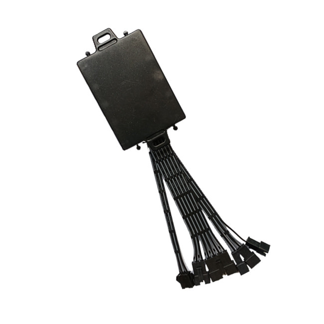

# TopShine - MT100

The 4G MT100 \(Model TSMB03\) is a professional vehicle GPS tracker engineered for fleet management and driver accountability. Designed for logistics, taxi fleets, bus operations and rental services, the MT100 provides Plaspy compatible real-time tracking over 4G/LTE with GSM fallback, integrated driver identification using RFID, iButton or fingerprint readers, and event logging that ties driving behavior directly to individual drivers.

With rugged vehicle-grade power support and broad network band coverage, the MT100 delivers dependable telemetry, mileage and running-time reporting, and anti-theft features including relay-based engine immobilizer control. When paired with Plaspy, fleets gain consolidated location, driver ID, alerting and reporting tools to reduce idle time, deter unauthorized use and improve operational efficiency.

## Key Highlights

- Plaspy compatible GPS tracker for real-time tracking and centralized fleet management.
- Driver identification via RFID, iButton or fingerprint to associate events with individual drivers for accountability and reporting.
- 4G/LTE primary communication with GSM fallback for broad, reliable coverage and fast telemetry updates.
- Remote immobilizer \(relay\) and SOS input for anti-theft response and emergency handling.
- Extensive event alarms: external power cut, door status, engine on/off, idle alerts and geo-fence triggers.
- Fleet telemetry features including mileage, running time, ACC \(ignition\) upload modes and impulse sensor detection.
- Optional accessories for fuel monitoring, driver monitoring and voice communication to extend anti-theft and operational insights.

## How It Works with Plaspy

The MT100 integrates with Plaspy to deliver continuous, Plaspy compatible real-time tracking, driver-linked event logging, alarm forwarding and downloadable reports. Position updates, telemetry and driver ID events are transmitted via 4G/LTE \(or GSM fallback\) to Plaspy, where managers can view live vehicle location, receive alerts, and generate driver-centric reports for compliance and performance review.

- Real-time location and telemetry updates transmitted to Plaspy for live monitoring and historical playback.
- Driver ID events \(RFID, iButton, fingerprint\) logged and associated with trips, stops and alarm events in Plaspy reports.
- Ignition/ACC on-off status and engine run-time telemetry for driver behavior and idle time analysis.
- Fuel monitoring support via optional capacitive or ultrasonic sensors, with data forwarded to Plaspy when installed.
- Remote immobilizer control \(relay\), SOS alerts and two-way voice capability available through Plaspy-enabled commands or SMS/TCP controls.
- Event alarms \(power cut, door open, geo-fence, temperature alerts\) forwarded as push notifications or platform alerts.

## Technical Overview

| Model | 4G MT100 \(TSMB03\) |
| --- | --- |
| Connectivity | 4G/LTE primary with GSM fallback |
| Bands | LTE-FDD B1/B3/B5/B8; LTE-TDD B34/B38/B39/B40/B41; GSM B2/B3/B5/B8 |
| Power & Battery | Input +9V to 90V DC; built-in backup battery 650 mAh |
| Interfaces & I/O | Ignition \(ACC\) detection, SOS input, relay output for engine cutoff, digital I/O for sensors; two-way voice \(mic/speaker optional\) |
| Driver Identification | Integrated RFID reader, iButton support, fingerprint reader support \(driver association and event logging\) |
| GNSS | GPS for real-time location tracking |
| Optional Sensors & Accessories | Capacitive/ultrasonic fuel sensors, temperature & humidity sensors, crash and alcohol sensors, fatigue/driver camera, microphone/speaker, OBD connector |
| Remote Management | Remote configuration via platform, SMS or TCP commands; two-way calling for driver communication |
| Dimensions & Weight | 80 x 58 x 22 mm; 88 g |
| Operating Conditions | -20°C to 65°C; humidity 5%–95% non-condensing |
| Package | Unit, wiring harness, relay, SOS button \(neutral packaging\) |

## Use Cases

- Fleet anti-theft and immobilization: remotely cut off engine and receive power-cut or door-open alarms to prevent unauthorized use.
- Driver accountability for logistics and taxi fleets: fingerprint or RFID driver ID links driving events to individuals for performance and safety coaching.
- Fuel monitoring and operational telemetry for long-haul trucks and delivery fleets using optional capacitive or ultrasonic sensors.
- Rental and car-share operations: driver identification, SOS button and two-way voice for customer support and incident response.
- Public transport and bus operations: idle alerts, mileage reporting and driver-specific logs to improve scheduling and safety metrics.

## Why Choose This Tracker with Plaspy

When paired with Plaspy, the MT100 delivers a focused solution for organizations that need reliable GPS tracking plus driver identification and control. Its wide input voltage range \(+9V to 90V\), robust operating temperature range and comprehensive event alarms make it well suited for mixed fleets of cars, vans and heavy vehicles. The built-in driver ID options \(RFID, iButton, fingerprint\) set the MT100 apart for use cases where tying events to a person matters for accountability, safety and compliance.

Plaspy compatibility means your fleet’s real-time tracking, telemetry and driver logs are available in a single platform for alerts, historical reporting and operational analytics. Remote immobilizer control, SOS handling and two-way voice add layers of anti-theft and emergency capability. Optional fuel, temperature and driver-monitoring accessories allow fleets to scale telemetry and safety features as needed. With OEM/ODM support and CE certification available, the MT100 is a practical, scalable choice for fleets that require integrated driver identification and Plaspy compatible tracking.

