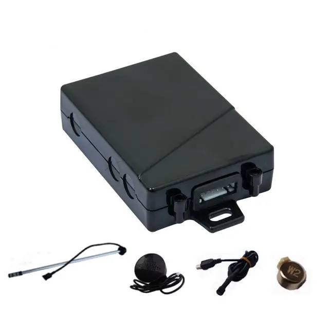

# TopShine - MT210

The MT210 is a compact, vehicle grade GPS tracker designed for continuous connectivity and discreet installation in cars, motorcycles and commercial fleets. It combines industrial components, quad band GSM connectivity and a sensitive GNSS receiver to provide reliable position reporting, geofence alerts and engine ignition telemetry. The unit is built for uptime with dual SIM failover, SMS and GPRS reporting, a built in backup battery and a wide DC input range suitable for mixed vehicle deployments.

As a Plaspy compatible device, the MT210 sends real time location updates and event data to Plaspy’s web and mobile platform for live monitoring and historical playback. Its support for features like geo fence alarms, ignition status and optional relay based immobilizer or SOS accessories makes it a practical choice for fleet managers and vehicle security workflows that use Plaspy for visibility, alerts and reporting.

## Key Highlights

- Plaspy compatible real time tracking and telemetry via SMS or GPRS for live maps and alerts.
- Dual SIM failover for improved cellular availability and continuous reporting.
- Vehicle telemetry including ignition status, geo fence alerts and power cut notifications.
- Optional relay based immobilizer and SOS panic button support for anti theft and emergency workflows.
- Built in rechargeable backup battery and wide DC input range to maintain operation during power interruptions.
- Compact waterproof housing suitable for concealed mounting in cars and motorcycles.
- Rugged vehicle grade construction designed for a wide operating temperature range and fleet use.

## How It Works with Plaspy

The MT210 delivers position fixes, status events and alarm messages to Plaspy using standard device reporting mechanisms so Plaspy can ingest and present the data in real time. Once connected, Plaspy provides map visualization, configurable alerts and reporting that leverage the MT210 telemetry to support operational oversight and incident response.

- Real time location and telemetry visible on Plaspy maps for live fleet monitoring.
- Ignition and external power loss events forwarded to Plaspy for immediate notification and logging.
- Geo fence and overspeed alerts reported into Plaspy for automated alerting and event history.
- Remote immobilizer control supported where the relay output is configured and allowed by local policy.
- SOS panic button events and emergency alerts routed to Plaspy notifications and incident workflows.

## Typical Use Cases

- Fleet management for cars, vans and mixed vehicle fleets needing continuous tracking and event alerts.
- Anti theft and recovery workflows using immobilizer support and power cut detection.
- Personal vehicle and motorcycle tracking where discreet installation and backup power are important.
- Equipment and trailer security monitoring for movement, location history and alerting.
- Emergency response and driver safety scenarios using SOS alerts and rapid notification through Plaspy.

## Why Choose This Tracker with Plaspy

The MT210 is a practical option for organizations that require reliable, always on vehicle tracking combined with Plaspy’s monitoring and reporting capabilities. Its dual SIM reliability, backup power and wide voltage tolerance make it adaptable across vehicle types, while accessory options such as relay immobilizers and SOS buttons extend its usefulness for security and emergency workflows.

Paired with Plaspy, the MT210 provides a straightforward telemetry stack for real time tracking, event driven alerts and historical analysis without unnecessary complexity. The device is well suited to pilots and scaled deployments where resilience, discrete installation and clear operational visibility are priorities.

For more details about Plaspy and platform capabilities you can learn more on the Plaspy website https://www.plaspy.com. Product specifications, availability and manufacturer details can change over time, so please verify current specifications and accessory options on the manufacturer website https://www.gztopshine.com/.
