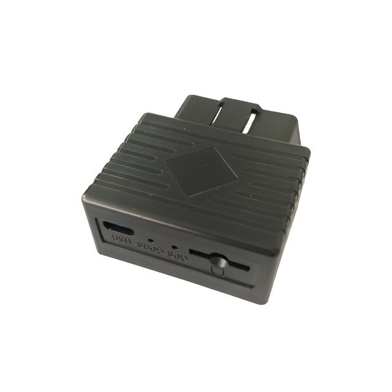

# TopShine - OTK01

The OTK01 is a compact plug and play OBD II GPS tracker designed for vehicle tracking and fleet management. It connects directly to a vehicle OBD port to deliver continuous location, diagnostic telemetry and event alerts without extra wiring. With AGPS acceleration for faster initial fixes, the OTK01 is positioned as a practical choice for operators who need quick deployment and consistent positional updates.

As a Plaspy compatible device, the OTK01 can integrate with Plaspy to provide real time tracking, reporting and historical playback. Its support for GPRS reporting and SMS commands allows Plaspy to ingest positional and vehicle state data so fleet managers and rental operators can monitor vehicles, receive alerts and review logged routes through the Plaspy platform.

## Key Highlights

- Plug and play OBD II installation for tool free setup and discreet placement
- Plaspy compatible with GPRS reporting and SMS command support for straightforward integration
- AGPS assisted positioning for improved first fix times in urban or obstructed environments
- Vehicle telemetry from the OBD port including latitude longitude speed direction and odometer readings
- Engine ON OFF detection and power cut tamper alarm to support anti theft workflows
- Onboard data logging storing thousands of waypoints for delayed upload and route playback
- Compact lightweight design with a small internal backup battery for brief power interruptions

## How It Works with Plaspy

When paired with Plaspy, the OTK01 delivers location and vehicle state data into the platform to enable live monitoring, alerts and historical analysis. Plaspy processes incoming reports from the device to show real time positions, event notifications and route history that help operations teams make timely decisions.

- Real time position updates and telemetry delivered to Plaspy via GPRS with SMS as a fallback for command and reporting
- Ignition state reporting for automated rules and alerts based on engine ON OFF events
- Power cut and tamper notifications forwarded to Plaspy to trigger immediate operator alerts
- Local data logging with delayed upload to ensure continuous route reconstruction when connectivity is intermittent
- Historical playback and reporting within Plaspy for trip review and operational analysis

## Typical Use Cases

- Fleet management and dispatch optimization for logistics and delivery operations
- Rental and shared vehicle tracking for location control and recovery
- Theft prevention and tamper detection with engine state and power cut alerts
- Personal vehicle monitoring for location history and basic diagnostics
- Rapid vehicle onboarding where low installation overhead is required

## Why Choose This Tracker with Plaspy

The OTK01 is a low friction option for organizations that need Plaspy compatible vehicle tracking without complex installation. Its plug and play OBD II connection reduces deployment time and installation cost, while onboard logging preserves route history through connectivity gaps. Combined with Plaspy, the device supports core fleet workflows such as live tracking, alerts, route replay and basic telemetry driven insights.

To learn more about how OTK01 devices can work with Plaspy visit https://www.plaspy.com. Product specifications and availability can change over time, so please verify current technical details and manufacturer documentation at https://www.gztopshine.com/.
