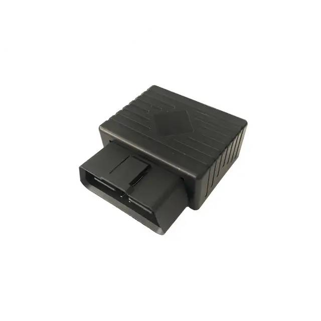

# TopShine - OTK02-4G

The TopShine OTK02-4G is a plug-and-play OBD II vehicle tracker designed for immediate installation and fast deployment. It provides real time tracking and OBD level telemetry over modern cellular connectivity, with assisted GNSS positioning and an integrated offline logger to preserve data during temporary coverage gaps. The model targets vehicle monitoring tasks where quick deployment and diagnostic visibility are important.

As a Plaspy compatible device, the OTK02-4G delivers location, trip and diagnostic information into Plaspy dashboards and alerts. Its simple plug in form factor and OBD telemetry make it practical for fleet managers and vehicle owners who want rapid integration with Plaspy for live monitoring, historical playback, and event based reporting.

## Key Highlights

- Plug and play OBD II installation for fast deployment without wiring
- 4G cellular connectivity with GSM fallback for broad coverage
- OBD sourced telemetry including mileage and engine on off status
- 2 MB offline data logger and a small backup battery to preserve records during outages
- Built in alarms for geo fence, towing or movement, overspeed and low battery events
- AGPS assisted positioning for faster time to first fix and reliable route playback
- Access to free web and Android tracking apps for monitoring and reports

## How It Works with Plaspy

When connected to Plaspy the OTK02-4G transmits GNSS positions and OBD derived telemetry over cellular channels so that fleet operators and vehicle owners can view live status and historical records through Plaspy interfaces. Plaspy ingests position, trip and event messages and makes them available for monitoring, alerting and reporting.

- Real time location and telemetry updates visible in Plaspy for live fleet oversight
- Engine on off and ignition events recorded from the OBD II interface and logged in Plaspy event history
- Mileage and trip history reported for utilization tracking and maintenance planning inside Plaspy reports
- Alarm events such as geo fence breaches, towing movement, overspeed and low battery forwarded as notifications
- Offline logger stores data when coverage is lost and synchronizes with Plaspy when connectivity resumes

## Typical Use Cases

- Fleet management for routing, utilization tracking and historical route analysis
- Anti theft monitoring using geo fences and movement alarms integrated into Plaspy alerts
- Vehicle diagnostics and maintenance planning based on OBD trip and mileage records
- Quick deployment for rentals or temporary tracking where rapid installation is required
- Remote monitoring of distributed vehicles or seasonal assets that need non invasive installation

## Why Choose This Tracker with Plaspy

The OTK02-4G pairs rapid OBD II deployment with actionable telemetry and offline resilience, making it a practical choice for organizations that need quick integration into Plaspy. Its OBD sourced data such as mileage and engine status complements Plaspy reporting and alerting to support maintenance planning and operational oversight without complex installation work.

For fleets and individual vehicle owners who prioritize straightforward installation, reliable position reporting, and continuous historical playback, the OTK02-4G is a useful Plaspy compatible option. Plaspy provides the monitoring, alerting and reporting layers to turn the device telemetry into operational insights and timely notifications.

Learn more about Plaspy on our main website https://www.plaspy.com. Product specifications and manufacturer details can change over time, so please verify current specifications and availability with the official manufacturer documentation at https://www.gztopshine.com/
