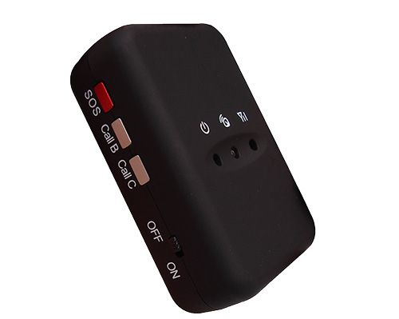

# TopShine - PT30

The TopShine PT30 is a compact, power saving personal GPS tracker designed for simple and portable location monitoring. It provides location updates via SMS or GPRS and offers practical safety features such as a two way conversation capability, an SOS panic button, geo fence alarm, and a speeding alert. The device includes built in memory for position logging and can generate a Google Maps link via SMS for quick viewing on a mobile device.

As a Plaspy compatible device, the PT30 can feed location and event data into Plaspy for centralized visibility and operational oversight. Its support for web based real time tracking and common communication methods makes it a practical option for organizations or individuals who need straightforward tracking of people, pets, and portable assets while retaining emergency alert and two way communication functionality.

## Key Highlights

- Compact, power saving personal GPS tracker suited for people and asset monitoring
- Location updates available via SMS and GPRS for flexible connectivity
- Real time tracking on a web platform and Google Maps link via SMS for quick map view
- Two way conversation and SOS panic button for emergency response
- Built in memory that can store a large number of waypoints for later retrieval
- Sleep mode and a backup battery to extend operational life when needed
- Supports TCP and UDP for server communication when used with tracking platforms

## How It Works with Plaspy

When connected to Plaspy, the PT30 can deliver location points and alert events to the platform so they are visible on a unified map and in operational workflows. Plaspy can surface the device's tracked positions, logged history, and alarm conditions to support monitoring and reporting needs.

- Display real time location on Plaspy maps and operator dashboards
- Upload and review stored waypoints and route history for playback and analysis
- Surface geo fence and speeding alarms in Plaspy for timely notifications
- Record SOS events and two way communication logs for incident handling
- Use SMS or GPRS updates as complementary sources so Plaspy can maintain visibility even when connectivity varies

## Typical Use Cases

- Monitoring children, elderly relatives, or tourists for personal safety
- Tracking portable assets and equipment during transport or storage
- Pet tracking and basic security for animals in transit or outdoors
- Providing a portable safety device for lone workers or small field teams
- Short term rentals and temporary deployments where installation is not practical

## Why Choose This Tracker with Plaspy

The PT30 is a sensible choice for users who need a no fuss, portable tracking device that pairs well with a cloud platform like Plaspy. Its combination of SMS and GPRS reporting, onboard logging, and emergency features gives organizations practical options for maintaining visibility and responding to events without complex setup.

For teams and individuals who rely on Plaspy for centralized fleet and asset oversight, the PT30 offers the fundamentals needed to feed location, alarm, and basic communication data into the platform so incidents can be monitored and recorded in one place.

To learn more about Plaspy and how it can work with devices like the TopShine PT30 visit https://www.plaspy.com. Product specifications, availability, and manufacturer details can change over time, so please verify current specifications on the manufacturer site https://www.gztopshine.com/.
