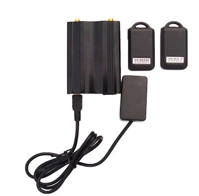

# TopShine - TK103R

The TopShine TK103R is a compact GPS vehicle tracker that integrates car alarm functionality and driver identification. It is designed to offer tracking and vehicle security in a small form factor, with features such as automatic arm and disarm, compatibility with the vehicle's original remote, RFID driver ID, location reporting, and a range of theft and movement alerts. The TK103R can report location and status via SMS or a tracking platform and provides options for automatic actions when certain conditions are met.

As a Plaspy compatible device, the TK103R can send location updates and alarm signals to Plaspy for visualization, alerting, and reporting. Plaspy can take the device data and present it on dashboards used for fleet monitoring, individual vehicle oversight, and security incident review, making the TK103R a practical option for organizations and vehicle owners who want an integrated tracking and alarm solution accessible through Plaspy.

## Key Highlights

- Combines GPS tracking with a car alarm and driver ID functions in one compact unit.
- Compatible with the vehicle original remote for locking and unlocking, reducing the need for multiple remotes.
- Automatic arm and disarm using RFID tags or remote commands to simplify day to day use.
- Multiple alert types including door open, ignition on, movement, geo fence exit, and over speed notifications.
- Location reporting available via SMS or a tracking platform with both GPS and cellular positioning options.
- Backup battery and external power failure alert to help maintain continuity of tracking and security.
- Supports remote actions such as power or fuel cutoff where platform support is available.

## How It Works with Plaspy

When connected to Plaspy, the TK103R's position updates and alarm events become actionable information for monitoring and operations teams. Plaspy ingests the device's reported data and presents it alongside fleet context to improve situational awareness and response.

- Real time location display on Plaspy maps with history playback for route review.
- Alert forwarding and aggregation so door, movement, geo fence, and over speed events appear in Plaspy notifications.
- Driver identification mapping in Plaspy using the TK103R RFID signals for better driver to vehicle attribution.
- Geofence configuration and event reporting inside Plaspy for automated zone monitoring.
- Trip and activity reports generated from TK103R data to support fleet oversight and operational analysis.
- Remote command support through Plaspy where the device and platform integration allow actions such as immobilization or arming/disarming.

## Typical Use Cases

- Personal vehicle security and anti theft monitoring with real time alerts.
- Fleet tracking for small to medium sized fleets that need location visibility and driver ID.
- Rental car and shared vehicle management with automatic arm and disarm workflows.
- Delivery and service vehicle oversight with movement and geofence alerts.
- High value vehicle protection with anti hijack alerts and voice monitoring arrangements.

## Why Choose This Tracker with Plaspy

The TK103R is well suited to organizations and vehicle owners seeking a compact device that blends tracking and alarm features. Its original remote compatibility and RFID driver identification simplify daily operations, and the range of alerts helps maintain visibility into vehicle status. When paired with Plaspy, the device data becomes part of a larger operational picture, enabling monitoring, alerting, and reporting that support security and fleet management needs.

Plaspy's platform brings TK103R location and event data into a single view for teams that need to monitor assets, review incidents, and manage responses. The combination makes the TK103R a practical choice for use cases where both security and routine tracking are important.

To learn more about how the TK103R works with Plaspy, visit https://www.plaspy.com for platform information and capabilities. Product specifications, availability, and manufacturer details can change over time, so please verify current specifications and official documentation on the manufacturer site https://www.gztopshine.com/ before making deployment decisions.
