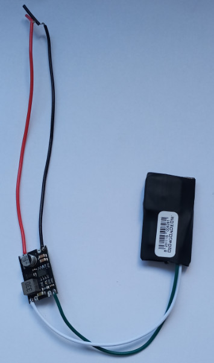

# TopShine - TLV01

The TLV01 Mini Hide GPS Tracker is a compact, covert device designed for discreet asset protection and vehicle security. Built for installers and fleet managers who need a small form factor with flexible power options, the TLV01 supports GSM GPRS and SMS reporting plus hybrid GPS and LBS positioning with AGPS assistance. Its design emphasizes concealment and continuous telemetry for monitoring vehicles and portable assets.

As a Plaspy compatible tracker, the TLV01 delivers the core signals and alarms that Plaspy uses to provide centralized monitoring. When paired with Plaspy, the device can supply continuous position updates, event alerts, and remote immobilization controls that help fleets and security teams respond quickly to theft or operational incidents. The TLV01 fits naturally into Plaspy workflows for live tracking, notifications, and historical reporting.

## Key Highlights

- Compatible with Plaspy for real time tracking via GSM GPRS and SMS reporting.
- Mini hide form factor suitable for covert placement in vehicles and portable equipment, installation size 45 x 25 x 8 mm.
- Wide input voltage range for flexible installations across cars, motorcycles and non automotive equipment.
- Backup battery and power saving modes help maintain telemetry when external power is interrupted.
- Hybrid GPS and LBS positioning with AGPS support to improve fixes in weak signal or indoor conditions.
- Configurable reporting and alarm options including geo fence, tow and overspeed events.
- Remote engine or oil cut off functionality for anti theft response and vehicle control.

## How It Works with Plaspy

Integrating the TLV01 with Plaspy makes device data available in a single platform for visibility, alerting and operational oversight. The tracker sends location and event data to Plaspy over GSM GPRS or SMS, and Plaspy presents that information on maps, in alerts and in historical reports for fleet and security teams to act on.

- Real time location updates forwarded to Plaspy for live mapping and tracking.
- Geo fence, tow and overspeed alarms delivered to Plaspy for immediate notification and workflow integration.
- Remote immobilizer support allows authorized control actions to be managed through Plaspy when device wiring supports engine or oil cut off.
- Power loss and external power cut events reported to Plaspy to indicate potential tampering.
- AGPS and LBS fallback improve position availability in weak GPS conditions and Plaspy selects the best available fix for display and reporting.

## Typical Use Cases

- Fleet management for cars and motorcycles requiring continuous tracking and alerting.
- Anti theft protection with covert installation and remote immobilizer for rapid recovery.
- Concealed tracking of portable assets and equipment for recovery after theft or loss.
- Rental and shared vehicle monitoring using geo fence and configurable reporting to enforce rules and detect misuse.

## Why Choose This Tracker with Plaspy

The TLV01 Mini Hide GPS Tracker is a practical choice for organizations that need a low profile device capable of delivering continuous position and event data to a fleet management platform. Its compact size, flexible power input and backup battery make it adaptable across a range of vehicle types and portable asset applications, while its alarm functions support timely security responses.

If you are evaluating compact trackers for integration into Plaspy, the TLV01 is worth considering for deployments that prioritize concealment, basic immobilizer control and reliable GSM based reporting. Learn more about Plaspy and how compatible trackers are used on the main website https://www.plaspy.com. Product specifications, availability and manufacturer details can change over time, so please verify current specifications and regional variants on the manufacturer site https://www.gztopshine.com/.
