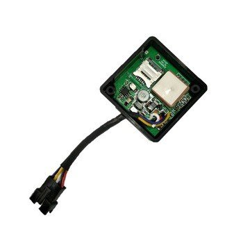

# TopShine - Ublox 7

The Ublox 7 Mini (Model MT06) is a compact industrial grade GPS tracker designed for motorcycles, small vehicles and light equipment. It combines a high sensitivity uBlox 7 GNSS chipset with a certified M35 GSM GPRS module in a waterproof enclosure to provide dependable real time tracking, configurable auto tracking and core telemetry for fleet management, anti theft protection and remote monitoring.

This model is Plaspy compatible out of the box, using an open protocol and standard SMS GPRS or TCP UDP connections to transmit position, status and alarms. That compatibility makes the Ublox 7 a practical option for organizations that want straightforward integration with Plaspy for live maps, history, alerts and reporting without needing extensive custom configuration.

## Key Highlights

- Plaspy compatible with open protocol support for straightforward platform integration.
- Compact and lightweight industrial design suitable for motorcycles and small vehicles.
- Waterproof housing and rugged construction for reliable operation in challenging conditions.
- Fast satellite acquisition and high sensitivity GNSS performance for consistent position fixes.
- Configurable alarms including overspeed and engine ON OFF detection for security and operational alerts.
- Supports SMS and GPRS communications for flexible connectivity options.

## How It Works with Plaspy

Integration with Plaspy uses the device ability to send GNSS position, status events and alarms over standard network channels so Plaspy can ingest and present that data in dashboards, maps and reports. Because the Ublox 7 supports an open protocol, Plaspy can parse location and event messages for live monitoring and automated workflows.

- Real time location updates and telemetry sent to Plaspy for live mapping and fleet visibility.
- Engine ON OFF status and ignition related events forwarded to Plaspy for trip logs and operational analysis.
- Overspeed and other configurable alarms delivered to Plaspy for automated alerts and notifications.
- Configurable auto tracking by time or distance preserved in Plaspy history for efficient reporting.
- Optional relay control and accessory inputs can be incorporated into Plaspy workflows where enabled.

## Typical Use Cases

- Fleet management for small vehicle fleets and motorcycle couriers requiring continuous tracking and trip history.
- Anti theft protection with engine status detection and optional remote immobilization capabilities.
- Motorcycle and scooter monitoring where compact size and waterproof construction matter.
- Light equipment tracking for portable assets that need rugged, discreet location reporting.
- Remote monitoring and operational oversight for small fleets that use Plaspy dashboards and alerts.

## Why Choose This Tracker with Plaspy

The Ublox 7 Mini balances size, durability and proven GNSS performance, making it a practical choice for teams that need reliable tracking from a compact device. Its open protocol and certified GSM modem simplify integration with Plaspy so organizations can quickly start receiving live position data, alarms and engine status without complex adaptation.

For operators focused on motorcycles, small vehicles or portable equipment, the Ublox 7 offers a rugged waterproof option that pairs well with Plaspy for mapping, alerts and reporting. Its configurable alarms and support for SMS and GPRS provide flexibility for both simple and more comprehensive tracking deployments.

Learn more about Plaspy and how compatible trackers can support your fleet and security workflows at https://www.plaspy.com. Product specifications availability and manufacturer details can change over time so verify current specifications and options with the official manufacturer documentation at https://www.gztopshine.com/.
