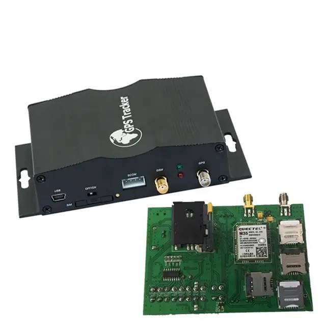

# TopShine - VT1000F

The TopShine VT1000F is an iButton car alarm GPS tracker designed for vehicle security and continuous multi country tracking. Built around driver identification with iButton or RFID and engineered for uninterrupted cellular connectivity through multiple SIM support, the VT1000F provides real time location updates, SOS emergency alerts and remote immobilizer control. Its feature set is aimed at operators who need persistent coverage, security event reporting and mileage or telemetry logging for vehicles in varied signal environments.

As a Plaspy compatible device, the VT1000F can feed location, driver identification and security events into the Plaspy platform for centralized monitoring, alerting and historical reporting. Plaspy ingests the device messages so fleet managers and security teams can view live positions, tie trips to identified drivers, receive SOS and alarm notifications, and act on immobilizer commands where policy permits. The combination makes the VT1000F relevant for organizations that require continuous tracking and driver aware security workflows within Plaspy.

## Key Highlights

- Compatible with Plaspy for live position reporting, event alerts and historical playback.
- Five SIM automatic switching to preserve cellular connectivity across regions and borders.
- iButton or RFID driver identification for driver based arming, disarming and trip association.
- Built in SOS emergency button and alarm reporting for rapid notification of incidents.
- Remote engine cut off immobilizer capability to support anti theft and recovery workflows.
- Telemetry and mileage logging with optional external camera pairing for incident documentation.

## How It Works with Plaspy

When connected to Plaspy, the VT1000F streams its location and event messages into the platform so operators can monitor vehicles in real time, investigate incidents and generate reports. Plaspy maps data from the device to vehicle records, applies configured alerting rules and retains historical trips for review.

- Real time location updates and route playback visible in Plaspy dashboards and maps.
- Driver iButton or RFID events reported to Plaspy to link trips to specific drivers for accountability.
- SOS alerts and unauthorized movement or ignition alarms forwarded to Plaspy and to preset contacts.
- Telemetry and mileage readings sent to Plaspy for performance monitoring and reporting.
- Remote immobilizer commands can be issued from Plaspy subject to operator policy and safety controls.
- Optional camera captures can be associated with location and driving logs for incident review.

## Typical Use Cases

- Cross border fleet operations requiring continuous cellular coverage and consistent tracking.
- Anti theft and anti hijack response with automated alarms and immobilizer control.
- Driver managed workflows where trips are tied to specific operators using iButton identification.
- Emergency response scenarios using SOS alerts and rapid location sharing with operations teams.
- Incident documentation and claims support by pairing location logs with optional camera captures.

## Why Choose This Tracker with Plaspy

The VT1000F is a practical choice for fleets and security conscious vehicle operators who need robust connectivity and driver aware security features. Its multi SIM approach and driver identification capabilities reduce gaps in visibility and help enforce driver level policies, while Plaspy aggregates those events into a single operational view for monitoring, alerting and analysis. For organizations focused on telemetry and incident management, VT1000F data presented in Plaspy supports decision making and post event investigation.

To learn more about how the VT1000F can work with Plaspy, visit https://www.plaspy.com. Product specifications, availability and manufacturer details can change over time, so please verify current technical information with the official manufacturer documentation at https://www.gztopshine.com/ before making procurement or deployment decisions.
