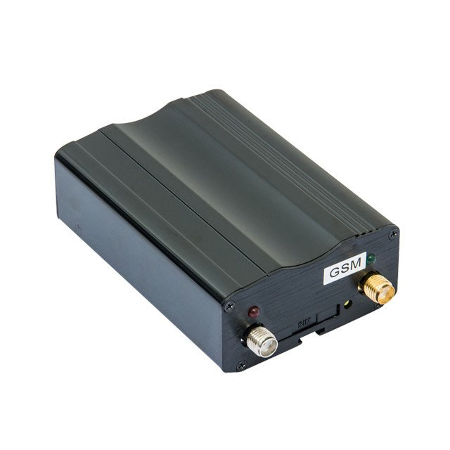

# TopShine - VT200

The TopShine VT200 is a professional vehicle GPS tracker designed for business fleet and asset management. Built around 2G GSM connectivity, the VT200 includes an internal backup battery and a 2MB data logger to preserve position records when coverage is intermittent. The device also provides multiple inputs and outputs, remote engine control capability, an SOS button and optional ultrasonic fuel sensing, making it suitable for use cases that require anti theft protection and fuel monitoring.

As a Plaspy compatible device, the VT200 can feed location, input/output state and recorded telemetry into Plaspy for live tracking, alerting and historical reporting. Its bundled antennas, wiring harness and relay simplify professional installations and enable operators to integrate the VT200 into Plaspy driven workflows for fleet visibility, operational oversight and asset security.

## Key Highlights

- Plaspy compatible real time tracking via 2G GPRS or SMS for continuous location feeds.
- Built in 2MB data logger and internal backup battery to preserve data during power loss or coverage gaps.
- Optional ultrasonic no drill fuel sensor support for fuel monitoring without tank modification.
- Multiple vehicle I O ports including digital and analog inputs plus relay outputs for remote engine control.
- Standard vehicle features such as geo fence over speed alert external power cut alarm and SOS panic input.
- Supplied accessories for professional fitment including GPS and GSM antennas SOS button wiring harness and relay.
- Industry certifications and warranty support with CE FCC RoHS marking and a two year warranty for business deployments.

## How It Works with Plaspy

The VT200 transmits position and telemetry to Plaspy using standard GPRS packets or SMS messages, while its data logger holds records during outages and uploads them when connectivity returns. Plaspy ingests coordinates plus I O and sensor states so fleets gain continuous visibility, alerts and historical context for operational decision making.

- Live location updates and telemetry visible on Plaspy maps and dashboards.
- Event driven alerts from ignition and digital input states for unauthorized movement or power cut.
- Fuel level reporting and alerts when the optional ultrasonic sensor is installed and configured in Plaspy.
- Remote immobilizer control via relay outputs where Plaspy supports command issuance to the device.
- Historical trip and route reports reconstructed from live feeds and stored logger data for compliance and analysis.

## Typical Use Cases

- Fleet management for cars vans and light trucks requiring live tracking and route history.
- Rental vehicle monitoring with over speed and power cut alerts to protect assets.
- Anti theft operations using remote engine cut off alerts and SOS panic reporting.
- Fuel monitoring programs that need no drill ultrasonic sensing integrated into reporting.
- Equipment and trailer tracking where backup power and data logging reduce gaps in visibility.

## Why Choose This Tracker with Plaspy

The VT200 offers the practical feature set many organizations need when integrating vehicle tracking into Plaspy. Its combination of live reporting options, local data logging and backup power reduces blind spots in coverage, while multiple inputs and relay outputs enable basic vehicle control and event detection that feed operational workflows in Plaspy. Supplied installation accessories and manufacturer warranty make it a pragmatic option for fleet operators who require a ready to deploy Plaspy compatible unit.

If you want to explore how the VT200 could work within your Plaspy deployment or compare it with other supported devices, learn more about Plaspy on our main website https://www.plaspy.com. Product specifications availability and manufacturer details can change over time so please verify current specifications on the official TopShine site https://www.gztopshine.com/ before purchase.
