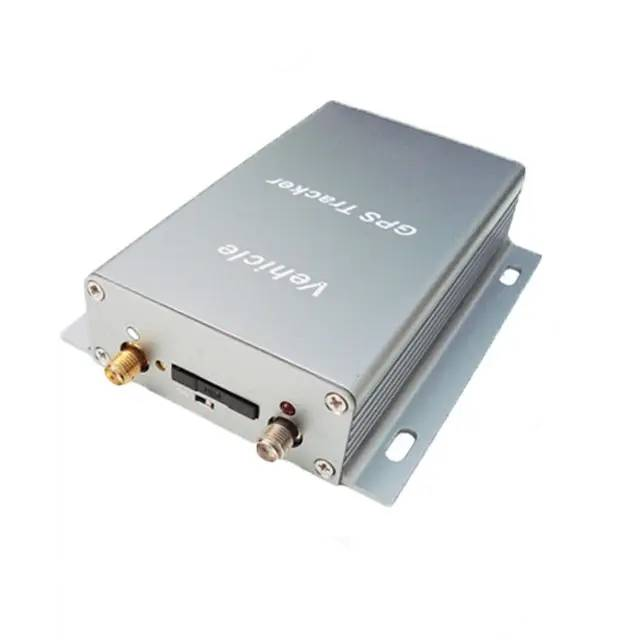

# TopShine - VT310N

The VT310N is a rugged vehicle tracker from TopShine designed for reliable real time tracking, fleet management, and vehicle security. It combines a high sensitivity GNSS receiver with cellular connectivity and an onboard data logger to maintain continuous location visibility and historical telemetry for commercial fleets, taxis, trucks, and mixed vehicle deployments.

As a Plaspy compatible device, the VT310N can feed location, event and sensor data into Plaspy for live monitoring, alerts and reporting. Its support for anti theft functions, remote immobilizer control, SOS alarm and multiple inputs makes it a practical choice for organizations that want to combine hardware telemetry with Plaspy dashboards and notifications.

## Key Highlights

- Designed for real time fleet tracking and vehicle security with Plaspy compatibility.
- High sensitivity GNSS performance for consistent position reporting and practical accuracy for fleet operations.
- Built in data logger that preserves position history when cellular connectivity is interrupted.
- Remote engine cut off via relay and SOS alarm support to assist theft response workflows.
- Multiple analog and digital inputs to accommodate fuel sensing and ignition detection for telemetry and alerts.
- Two way voice and camera monitoring support to improve driver communication and situational awareness.
- Vehicle grade power range and built in backup battery to maintain uptime during power disruptions.

## How It Works with Plaspy

When integrated with Plaspy, the VT310N transmits GNSS and event data to the platform so fleet managers can monitor vehicles on live maps, receive event notifications, and review historical trips. Plaspy ingests the tracker data and makes it available through dashboards, reports and configurable alerts that support operational and security workflows.

- Live location and telemetry updates appear on Plaspy maps for dispatch and oversight.
- Event driven alerts such as SOS, geo fence breaches and overspeed conditions are forwarded to Plaspy for immediate notification.
- Remote immobilizer control can be coordinated through Plaspy workflows to support anti theft procedures.
- Fuel related telemetry from analog inputs can be presented in Plaspy reports and used to trigger fuel loss alerts.
- Offline logged data is uploaded to Plaspy after connectivity is restored to preserve route history and event continuity.

## Typical Use Cases

- Fleet anti theft and immobilization scenarios for commercial vehicles where remote control and alerts are needed.
- Taxi and ride sharing operations that require two way communication, monitoring and compliance alerts.
- Fuel monitoring and consumption reporting for vehicles with analog fuel sensor integration.
- Driver safety and behavior monitoring feeding incidents into Plaspy analytics for coaching.
- Vehicle deployments that need reliable offline logging during coverage gaps and automatic recovery of historical data.

## Why Choose This Tracker with Plaspy

The VT310N is a versatile vehicle tracker that pairs practical hardware features with Plaspy platform capabilities. Its support for offline logging, anti theft functions and flexible input options makes it suitable for organizations that need both live visibility and reliable historical records. Combined with Plaspy, the VT310N can support alerting, reporting and operational controls that improve security and fleet efficiency.

To learn more about how Plaspy works with devices like the TopShine VT310N visit https://www.plaspy.com. Product specifications and availability can change over time, so please verify current details and official documentation on the manufacturer site https://www.gztopshine.com/ before purchasing or deploying devices.
