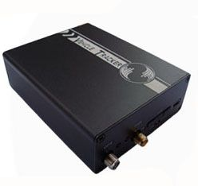

# TopShine - VT900

The TopShine VT900 is a vehicle GPS/GSM/GPRS tracker built for real time location monitoring and vehicle security. It combines high sensitivity positioning modules with GSM based reporting to provide continuous tracking, position logging, and a range of vehicle related alerts. The device also supports multimedia and audio functions such as camera support and voice prompt or broadcasting, and it includes features designed for operational oversight like mileage calculation, door status detection, and a built in backup battery.

As a Plaspy compatible device, the VT900 can be integrated into web based fleet management workflows to deliver live visibility and event notifications through the Plaspy platform. Its support for SMS and GPRS reporting, configurable time or distance based tracking, OTA update capability, and remote command functions make it a practical choice for organizations that want to centralize vehicle monitoring and security within Plaspy for reporting, alerts, and operational control.

## Key Highlights

- Real time tracking via SMS or GPRS with configurable reporting intervals for time or distance
- Supports camera and voice prompt features for added situational awareness and driver messaging
- OTA function and expandability for easier maintenance and customization
- Vehicle status features including engine on off detection, remote engine cut off, and door open close detection
- Built in motion sensing and backup battery for power aware operation and position logging
- Multiple alert types such as overspeed, geo fence, low power, SOS panic, and harsh driving events
- Onboard memory for logged positions to support historical route and mileage reporting

## How It Works with Plaspy

When connected to Plaspy, the VT900 delivers vehicle position and event data to the Plaspy platform where it can be visualized, monitored, and reported. Plaspy can use the device data to provide a centralized view of fleet activity, trigger notifications, and support operational decision making.

- Live map visualization of unit locations and movement for fleet oversight
- Event and alert delivery for overspeed, geo fence breaches, SOS, and power issues routed through Plaspy notifications
- Historical route playback and mileage reporting using the device position logs for compliance and analysis
- Remote command and monitoring support such as position requests, remote listening or call based location checks, and engine control where configured
- Device health indicators and power state monitoring to help prioritize maintenance and charging actions

## Typical Use Cases

- Fleet management and dispatch where real time location and route history improve routing and utilization
- Vehicle security and anti theft workflows using remote engine cut off, SOS alerts, and location tracking
- Rental and leasing operations needing mileage reporting and tamper or door status monitoring
- Logistics and delivery operations requiring route proof, geofence enforcement, and driver behavior alerts
- Service vehicle oversight for maintenance scheduling and operational accountability

## Why Choose This Tracker with Plaspy

The VT900 pairs a broad set of vehicle focused features with flexible reporting modes, making it a sensible option for organizations that require both real time visibility and historical analysis. Its multimedia and audio support plus expandability options provide additional flexibility for fleets that need integrated situational awareness beyond basic location data.

Combined with Plaspy, the VT900 helps centralize tracking, alerting, and reporting in a web based platform that supports operational oversight and decision making. For specific deployment needs, confirm the particular feature set and command capabilities you plan to use with Plaspy to ensure the best integration and configuration.

To learn more about how Plaspy can work with compatible trackers like the TopShine VT900 visit https://www.plaspy.com. Product specifications, availability, and manufacturer details can change over time, so verify current technical specifications and feature support on the manufacturer website https://www.gztopshine.com/ before purchase or deployment.
