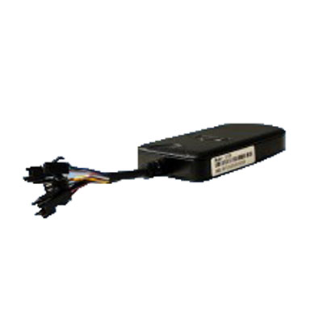

# TopTen - GT08

The TopTen GT08 is a versatile 2G/3G vehicle GPS tracker that offers a wide range of functions to help you keep track of your vehicles. Whether you want to monitor your fleet, ensure the safety of your loved ones, or protect your valuable assets, the GT08 has you covered. With the ability to track via SMS, web, or app, you can easily keep an eye on your vehicles from anywhere, at any time.

One of the standout features of the GT08 is its RFID capability, which allows for personnel identification. With support for a 2.4G active RFID reader and Mifare1 IC card reader \(optional\), you can easily manage access to your vehicles and ensure that only authorized individuals are able to operate them. Additionally, the GT08 supports keyless alarm functions, allowing you to arm/disarm the tracker via SMS, web, calling, or RFID tag.

Other notable features of the GT08 include real-time physical address tracking, even in areas with no GPS signal, smart engine on/off and door open/close status detection, voice monitoring and 2-way talking \(optional\), various alarm functions such as engine on alarm, power failure alarm, vibration alarm, and over-speed alarm \(optional\), as well as the ability to track by time interval or distance. The GT08 also offers a range of safety features, including the ability to stop the car safely via SMS or web, speed limitation to automatically slow down the car when the speed is over the limit, crash alarm \(optional\), and fatigue driving alarm.

With its industrial design and high-performance ARM7 processor, the GT08 is built to withstand the demands of everyday use. It has a wide working voltage range of 10V-60VDC, making it suitable for motorcycles, cars, and most big trucks. The tracker also features a smart power-saving design to protect the vehicle battery and a built-in 8M-bit offline data logger that can store up to 9,090 waypoints. The GT08 is equipped with a rechargeable 3.7V 500mAh Li-ion battery for backup power and has a compact size of 99\*52\*17mm, weighing only 76g.

Overall, the TopTen GT08 is a reliable and feature-packed GPS tracker that offers advanced tracking capabilities, comprehensive alarm functions, and user-friendly operation. Whether you're a fleet manager, a concerned parent, or a business owner looking to protect your assets, the GT08 is an excellent choice.

### Key Features:

- Track on SMS, Web or APP
- RFID for personnel identification
- Supports 2.4G keyless alarm functions
- Real-time physical address tracking
- Check location by LBS even without GPS signal
- Smart engine on/off and door open/close status detection
- Voice monitoring and 2-way talking \(optional\)
- Various alarm functions: engine on, power failure, vibration, over-speed, SOS \(optional\)
- Track by time interval or distance
- Stop the car safely via SMS or web
- Upgrade normal car alarm with GPS tracking function
- Speed limiter to automatically slow down the car
- Crash alarm \(optional\)
- Fatigue driving alarm
- Analog input for fuel monitoring and fuel loss alarm
- 4 digital inputs, 1 analog input, and 1 digital output
- Wide working voltage range: 10V-60VDC
- Smart power-saving design
- 8M-bit offline data logger
- User-defined SMS contents in different languages
- Industrial design with high-performance ARM7 processor

