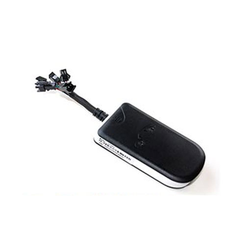

# TopTen - GT08S

The TopTen GT08S is a compact vehicle GPS tracker designed for monitoring cars, motorcycles, and larger vehicles. It supports a wide input voltage range which makes it suitable for diverse vehicle types. The GT08S provides on demand and interval tracking via SMS or GPRS, includes a data logger for route history, and offers several alarm and control features to help maintain visibility over vehicle activity.

As a device compatible with Plaspy, the GT08S can feed location and event information into a fleet management platform for consolidated monitoring and reporting. Its configurable tracking modes, remote arming and disarming options, and waypoint storage make it a practical option for organizations that want to integrate device telemetry and alerts into Plaspy for operational oversight.

## Key Highlights

- Wide input voltage compatibility suitable for motorcycles, cars, and heavier vehicles
- On demand or scheduled position updates via SMS or GPRS for flexible tracking
- Remote arm and disarm options using SMS platform commands or phone call control
- Built in data logger storing up to 5000 waypoints for route review and playback
- 2.4G RFID tag support for wireless immobilization and added security measures
- Multiple alarm types including overspeed, movement, vibration, engine on, and optional door open alerts

## How It Works with Plaspy

When connected to Plaspy the GT08S becomes part of a unified fleet view that combines location, historical routes, and event notifications for easy monitoring. Plaspy receives position updates and alerts from the device and presents them alongside other assets so teams can manage vehicles from a single platform.

- Consolidate GT08S location updates within Plaspy for live map visibility and tracking
- Forward device alarms into Plaspy to trigger notifications and operational workflows
- Use stored waypoint data for retrospective route analysis and reporting in Plaspy
- Centralize remote control actions and status changes so admins can see device state in the platform
- Generate fleet level reports that include vehicles using the GT08S for utilization and activity review

## Typical Use Cases

- Fleet monitoring for small to medium vehicle fleets including cars and vans
- Motorbike or scooter tracking programs where wide voltage tolerance is beneficial
- Security and recovery workflows that use RFID immobilization and alarm notifications
- Route history review for delivery, service, or inspection vehicles
- Mixed vehicle fleets where a single tracker model needs to support varied power systems

## Why Choose This Tracker with Plaspy

The GT08S pairs practical tracking features with a device profile that fits many common fleet scenarios. Its combination of remote control, waypoint logging, and alarm flexibility makes it a sensible choice for organizations that need both live visibility and historical route data. For operations already using Plaspy, adding GT08S units lets teams consolidate device information into one management environment.

If you want to explore how the GT08S can fit into your Plaspy deployment, learn more about the Plaspy platform at https://www.plaspy.com. Product specifications and availability can change over time so please verify the latest technical details and options on the manufacturer site http://www.t10.cn.
