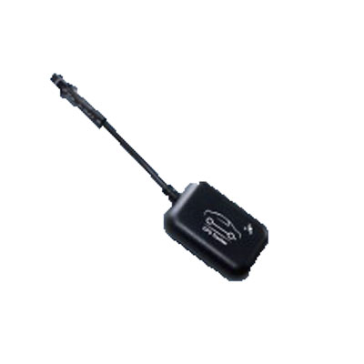

# TopTen - MT05

The TopTen MT05 is a compact vehicle GPS tracker designed to combine location monitoring with vehicle security functions. It supports location reporting via SMS, web, or mobile app and provides physical address information that can include city and street name. The MT05 also integrates alarm features and status detection for engine on and off, making it suitable for a range of vehicle types from motorcycles to cars and larger trucks.

As a Plaspy compatible device, the MT05 can be used within Plaspy to bring those tracking and alarm capabilities into a unified fleet management environment. Plaspy can present live location data, event alerts, and basic odometer information collected by the MT05 so teams can monitor vehicles, respond to incidents, and keep operational records without switching between separate vendor tools.

## Key Highlights

- Multi mode tracking with SMS web and app reporting for flexible access to location data
- Real physical address reporting including city and street level information
- Built in vehicle alarm functions with multiple alert types such as overspeed movement and vibration
- Smart engine on off status detection to support basic operational monitoring
- Odometer function and a wide operating voltage range suitable for motorcycles cars and most big trucks
- Waterproof compact design and hardware watchdog for improved durability and reliability

## How It Works with Plaspy

When used with Plaspy the MT05 feeds location and status events into the platform so fleet managers and operators can view devices alongside other assets and apply Plaspy tools for oversight and reporting. Integration brings the tracker data into Plaspy interfaces for real time visibility and historical review.

- Display live vehicle position and recent location history on Plaspy maps
- Receive and centralize alarms such as overspeed movement and power failure within the Plaspy alert system
- Monitor engine on off events and odometer readings for basic utilization reporting
- Use Plaspy reporting to export trip and event summaries for operations and compliance checks
- Configure notification rules in Plaspy to route critical events to the right teams

## Typical Use Cases

- Theft prevention and recovery for private cars and fleet vehicles using address reporting and alarms
- Routine fleet monitoring for light commercial vehicles and delivery fleets
- Security for motorcycles and scooters where compact waterproof units are preferred
- Tracking and utilization monitoring for mixed fleets including larger trucks
- Rental vehicle oversight to detect unauthorized movement or engine events

## Why Choose This Tracker with Plaspy

The MT05 is a practical option when you need a compact tracker that combines location reporting with a range of alarm and status features. Its support for SMS web and app reporting and its address reporting capability make it easy to obtain human readable locations in addition to map coordinates, which can simplify recovery and dispatch workflows.

Paired with Plaspy, the MT05 becomes part of a centralized monitoring and reporting solution that can reduce the time needed to detect incidents and assemble vehicle history. If your requirements emphasize straightforward location visibility, basic engine status, and multiple alarm types across a mixed vehicle fleet, the MT05 is worth considering as a cost effective component in a Plaspy managed setup.

To learn more about Plaspy and how compatible devices are managed visit https://www.plaspy.com. Product specifications and availability can change over time so please verify current details and official documentation on the manufacturer site http://www.t10.cn.
