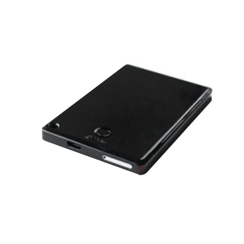

# TopTen - PT99

The TopTen PT99 personal asset GPS Tracker is a versatile and reliable device that offers a wide range of features and functions to ensure the safety and security of your assets. Whether you need to track a vehicle, monitor a valuable item, or keep an eye on a loved one, the PT99 has you covered.

One of the standout features of the PT99 is its ability to track on command, by time interval, or by clock. This gives you the flexibility to choose the tracking method that best suits your needs. Additionally, you can easily arm or disarm the tracker using SMS, the platform, or a phone call, providing you with convenient control over the device.

The PT99 also offers advanced tracking capabilities, allowing you to check the real physical address of your asset, track its location via mobile SMS to get detailed information such as latitude, longitude, speed, direction, and odometer readings. You can even check the location directly on Google Maps using the provided URL.

In terms of security, the PT99 is equipped with a vibration alarm, SOS alarm, and over-speed alert, ensuring that you are promptly notified of any suspicious activity or potential dangers. The device also features a built-in shock sensor for power saving and triggering alarms, as well as a battery low-level alarm to keep you informed of the tracker's battery status.

With its A-GPS function and the ability to check coordinates via LBS, the PT99 can provide accurate and reliable tracking even in areas with poor GPS signal. Additionally, the device supports voice monitoring and two-way talking, allowing you to listen in and communicate with the tracker remotely.

The PT99 offers four types of working modes for power saving, including an extreme power save mode that can extend the tracker's battery life for months. This makes it an ideal choice for long-term tracking or situations where frequent battery charging is not feasible.

Overall, the TopTen PT99 personal asset GPS Tracker is a feature-packed device that combines advanced tracking capabilities, reliable security features, and power-saving options. Whether you need to track a vehicle, monitor a valuable item, or ensure the safety of a loved one, the PT99 is a reliable and versatile solution.

