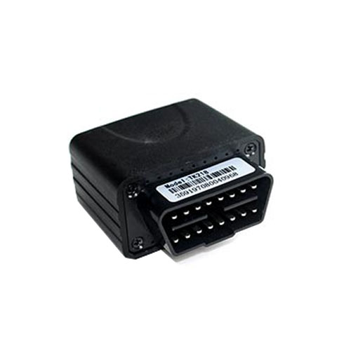

# TopTen - TK218

The TopTen TK218 is an OBD car and truck GPS tracker designed for on‑board vehicle monitoring. With a plug and play OBD-II connector and support for CAN-BUS systems, the TK218 provides location tracking, route history, and a range of vehicle status reports. It supports tracking on demand or at set intervals via SMS or GPRS, and includes alarms for overspeed, movement, engine on, vibration, and power failure, plus voice monitoring and a built‑in data logger.

As a Plaspy compatible device, the TK218 can feed location and vehicle status data into the Plaspy platform to provide centralized visibility for fleets and vehicle operators. Its OBD form factor and remote diagnostics features make it a practical choice for organizations that want plug‑and‑play installation combined with position reporting, odometer reporting, and alarm notifications within Plaspy dashboards and reports.

## Key Highlights

- Plug and play OBD-II connector for simple vehicle connection
- Supports CAN-BUS systems for broad vehicle compatibility
- Track on command or by interval using SMS or GPRS
- Built‑in alarms including over‑speed, movement, engine on, vibration, and power failure
- Voice monitoring and remote diagnostics including VIN and DTC reading
- Internal rechargeable backup battery and wide operating voltage range
- Onboard data logger capable of storing thousands of waypoints

## How It Works with Plaspy

When paired with Plaspy, the TK218 provides position and vehicle status feeds that Plaspy ingests to deliver monitoring, alerts, and historical reporting. Plaspy can use the tracker’s location, alarm events, and diagnostic outputs to improve fleet oversight and operational decision making.

- Real‑time location and historical route playback within Plaspy dashboards
- Forward alarm events such as overspeed, movement, and power failure as notifications or alerts
- Integrate odometer readings, VIN and diagnostic codes into maintenance and reporting workflows
- Use physical address lookups and geofenced areas to trigger operational alerts and location context
- Store and export trip logs and waypoint data collected by the TK218 for analysis
- Where configured, access voice monitoring data through Plaspy to review vehicle surroundings

## Typical Use Cases

- Fleet tracking for cars and light to heavy trucks using the OBD interface
- Remote diagnostics and maintenance planning using odometer and DTC information
- Theft deterrence and recovery workflows with movement and power loss alarms
- Driver behavior monitoring with overspeed and engine activity alerts
- Rental and shared vehicle oversight with quick plug and play deployment

## Why Choose This Tracker with Plaspy

The TK218 is a practical option for organizations that prefer an OBD form factor for quick deployment and need both location tracking and vehicle diagnostics. Its combination of alarm functions, data logging, and diagnostic readouts means fleets can centralize monitoring and maintenance workflows in Plaspy without extensive hardware changes to the vehicle.

Because the TK218 is compatible with Plaspy, fleets and vehicle operators can combine the tracker’s telemetry with Plaspy’s reporting, alerting, and operational tools to improve visibility and simplify routine oversight. For precise behavior or advanced integrations, confirm that the specific TK218 firmware and feature set meet your operational needs.

To learn more about how Plaspy can work with the TopTen TK218, visit https://www.plaspy.com. Product specifications, availability, and manufacturer details can change over time, so please verify current specifications and documentation with the manufacturer at http://www.t10.cn.
