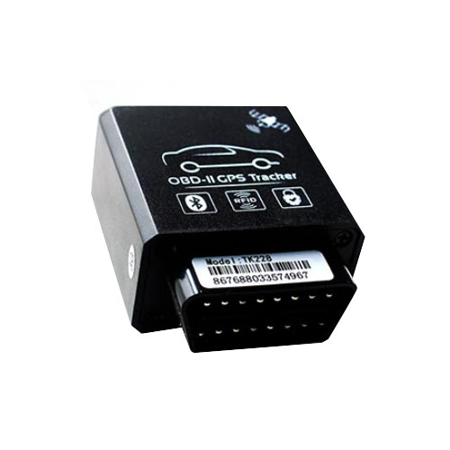

# TopTen - TK228

The TopTen TK228 is a versatile vehicle GPS tracker that combines location tracking with a suite of security and diagnostic features. Designed for direct connection to vehicles with an OBDII port, the TK228 provides integrated GPS location, RFID car alarm control, Bluetooth diagnostics, a wireless immobilizer, and multiple alarm conditions to help protect vehicles and monitor their operational state.

As a Plaspy compatible device, the TK228 can feed its tracking, alarm, and diagnostic information into the Plaspy fleet platform for centralized visibility and management. This makes the device relevant for fleet operators and vehicle security programs that need consolidated location data, alerting, and basic remote diagnostics alongside other vehicles managed through Plaspy.

## Key Highlights

- Plug-in OBDII form factor for quick deployment in compatible vehicles
- Integrated GPS tracking alongside GSM location fallback for improved coverage
- Built-in vehicle security features including RFID alarm, wireless immobilizer, and anti tamper locking
- Multiple alarm types such as movement, over-speed, geo-fence, engine on, power failure, and vibration
- Onboard backup battery for emergency reporting if main power is cut
- Remote diagnostics and driver behavior observations available via Bluetooth or network transmission

## How It Works with Plaspy

When used with Plaspy, the TK228 supplies location, alarm events, and vehicle diagnostic signals to the platform so fleet managers gain unified operational insight. Plaspy ingests the device data and presents it alongside other fleet assets for monitoring, alerts, and reporting.

- Real time location and tracking displayed on Plaspy maps and dashboards
- Alarm event forwarding for immediate notifications on movement, tamper, over-speed, power loss, and geo-fence breaches
- Diagnostic and driver behavior data available for trend reporting and operational oversight
- Immobilizer and remote alarm state indicators visible in the Plaspy interface for coordinated response
- Historical trip, speed, and odometer records accessible in Plaspy for auditing and analysis

## Typical Use Cases

- Fleet management for light commercial vehicles where fast OBDII installation is desirable
- Vehicle security programs using RFID alarm and immobilizer features to deter theft
- Rental and shared vehicle operators needing location tracking plus power and tamper alerts
- Service and maintenance teams leveraging remote diagnostics and vehicle health indicators
- Driver behavior monitoring to support safety and compliance efforts

## Why Choose This Tracker with Plaspy

The TK228 pairs practical in-vehicle convenience with a broad set of security and reporting features, making it a good match for organizations that want to add tracking and basic diagnostics without extensive installation work. Its combination of alarms, backup power reporting, and remote immobilizer control complements Plaspy's fleet visibility and alerting capabilities, helping teams react faster to incidents and maintain a clear operational picture.

Because the TK228 delivers both location and vehicle status data, it can reduce the need for separate devices and simplify fleet onboarding into Plaspy. Organizations should evaluate their vehicle compatibility and reporting needs to confirm the TK228 matches their operational requirements.

To learn more about how Plaspy can manage devices like the TopTen TK228 visit https://www.plaspy.com. Product specifications and availability can change over time; for the most current technical details and manufacturer information please consult the official TopTen site at http://www.t10.cn.
