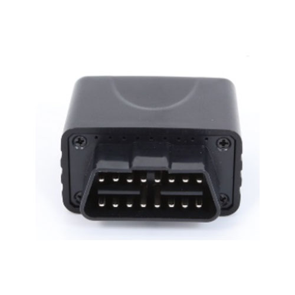

# TopTen - TK428

The TopTen TK428 is an OBD II GPS tracker designed to provide continuous vehicle location together with vehicle ECU telemetry. Plugged into a vehicle's OBD port, the TK428 can read common vehicle data such as speed, RPM, odometer, fuel consumption, and driver behavior indicators, making it useful for operational oversight and basic vehicle diagnostics.

As a device compatible with Plaspy, the TK428 can deliver both position and telemetry streams into the Plaspy platform for centralized visibility. That compatibility makes the TK428 a practical choice for organizations and individuals who want to combine location tracking with ECU-sourced data for fleet monitoring, usage reporting, and driver performance insight.

## Key Highlights

- Plug and play OBD II form factor for quick deployment in vehicles with an OBD connector
- Simultaneous GPS location tracking and ECU telemetry collection including speed, RPM, odometer, and fuel data
- Broad vehicle compatibility through support for common CAN bus and OBD protocols
- Useful for fleet managers seeking consolidated vehicle and driver information
- Helps enable monitoring of vehicle usage and basic driver behavior metrics
- Suitable for both commercial fleets and personal vehicle monitoring scenarios

## How It Works with Plaspy

When integrated with Plaspy, the TK428 forwards location and ECU-derived telemetry to the Plaspy platform where that data is visualized, analyzed, and archived. Plaspy brings these streams together to support operational monitoring and reporting across a vehicle fleet.

- Live and historical vehicle location shown on Plaspy maps for route review and dispatching
- Telemetry feeds available for correlation with trips to support fuel and usage analysis
- Alerts and notifications in Plaspy based on vehicle events and driver behavior patterns
- Fleet-level dashboards and reports combining location and ECU data for operational insight
- Centralized logging to retain trip and telemetry history for compliance or review

## Typical Use Cases

- Fleet management and route oversight for light commercial vehicles
- Monitoring vehicle usage and basic maintenance indicators via ECU data
- Tracking and reviewing driver behavior patterns to inform training
- Parental or personal monitoring of vehicle location and driving habits
- Rental or company vehicle oversight to combine location with usage metrics

## Why Choose This Tracker with Plaspy

The TK428 pairs a familiar OBD II installation model with a range of ECU data points that add context to raw GPS positions. For organizations that need both location and vehicle performance signals, that combination supports a more complete operational picture without requiring complex hardware changes to the vehicle.

Because the TK428 is designed for broad OBD compatibility, it can serve mixed fleets where vehicle makes and models vary. Using Plaspy to aggregate the TK428 data helps turn individual device streams into actionable fleet insights, centralized reporting, and consistent alerts.

If you want to learn more about how Plaspy can work with the TopTen TK428 and other compatible devices, visit https://www.plaspy.com. Product specifications and availability can change over time, so please verify current details and vehicle compatibility on the manufacturer site http://www.t10.cn.
