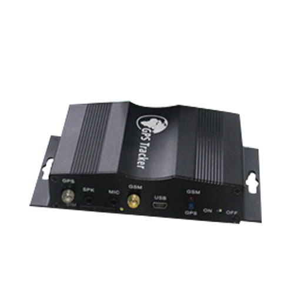

# TopTen - TK510

The TopTen TK510 is a versatile vehicle GPS tracker designed to provide continuous tracking and a range of security functions for cars and larger vehicles. It supports real time tracking on demand or at scheduled intervals, and can report location details such as latitude, longitude, speed, direction, and odometer readings. The unit also includes vehicle security features such as an RFID car alarm with long distance tag and a built in shock sensor, plus a rechargeable backup battery for uninterrupted operation.

As a Plaspy compatible device, the TK510 can be integrated into fleet and asset monitoring workflows to provide location visibility and event alerts within the Plaspy platform. Its combination of tracking, driver ID options, and alarm capabilities makes it a practical choice for organizations that need both operational oversight and enhanced vehicle security while using Plaspy for centralized monitoring and reporting.

## Key Highlights

- Real time GPS tracking on command or at configured intervals for continuous visibility
- RFID driver ID and long distance car alarm for added access control and security
- Rich alert set including over speed, geo fence, movement, SOS, and anti tamper alarms
- Capability to send photos via MMS or email to support incident review
- Odometer reporting and offline data logging for mileage and historical playback
- Built in shock sensor and rechargeable backup battery for resilience in the field

## How It Works with Plaspy

When connected to Plaspy, the TK510 supplies location and event data that Plaspy displays on maps and in reports, enabling centralized monitoring of vehicles and drivers. Plaspy can aggregate alerts from the device and present them in dashboards, allowing fleet managers to respond quickly to incidents and to analyze patterns across a fleet.

- View live vehicle positions and recent location history in the Plaspy interface
- Receive and manage alerts such as over speed, geo fence breach, movement, and SOS within Plaspy
- Track odometer and waypoint data for reporting and route analysis
- Associate RFID driver ID events with vehicle activity to support driver logs and accountability
- Access incident photos and messages sent by the device for operational review

## Typical Use Cases

- Fleet vehicle location monitoring for dispatch and route oversight
- Vehicle security with RFID based driver identification and remote alarm management
- Mileage tracking and historical playback for maintenance planning and cost allocation
- Overspeed and geo fence monitoring to enforce safety and route compliance
- Emergency response support using SOS alerts and incident photos

## Why Choose This Tracker with Plaspy

The TK510 combines practical tracking functions with vehicle security features that address both operational monitoring and theft deterrence needs. For organizations using Plaspy, the device supplies the core location and event data Plaspy needs to provide map based visibility, alerts, and basic reporting, making it suitable for mixed fleets of cars and larger vehicles.

While the TK510 offers a broad feature set, choosing it for your Plaspy deployment should be based on the specific data flows and alerting you require. Plaspy can surface the device's tracking, alert, and driver ID information in a single dashboard, helping teams streamline monitoring and incident handling without assuming incompatible features.

To learn more about how Plaspy works with compatible trackers like the TopTen TK510 visit https://www.plaspy.com. Product specifications, availability, and manufacturer details can change over time, so please verify current technical information on the manufacturer site http://www.t10.cn.
