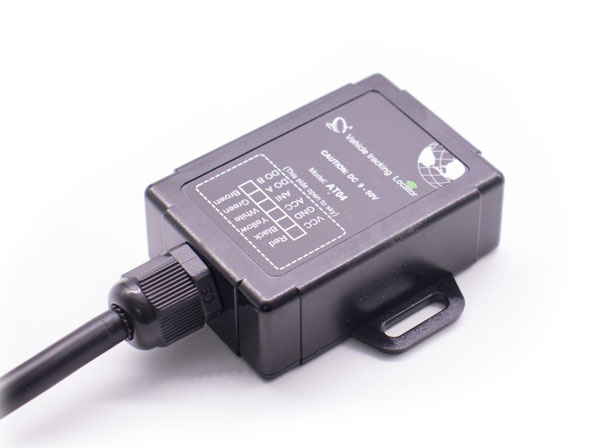

# Totemtech - AT04

The Totemtech AT04 is a compact, waterproof vehicle GPS tracker designed for motorcycles, cars and light trucks. Its small form factor and wide DC input range make it suitable for mixed fleets that need discreet installation and consistent position reporting. The device combines multi GNSS positioning with integrated antennas to provide continuous location data for operational tracking.

As a Plaspy compatible device, the AT04 can deliver real time positions, sensor inputs and event alarms into Plaspy for mapping, alerts and reporting. Its low power characteristics, anti theft features and fuel monitoring capability make it a practical option for fleet managers who want reliable telemetry and straightforward integration with Plaspy dashboards and alerting tools.

## Key Highlights

- Compatible with Plaspy for real time tracking and fleet management integration.
- Multi GNSS positioning including GPS GLONASS and Beidou for improved location accuracy.
- Compact IP67 rated enclosure and integrated antennas for discreet weather resistant use.
- Low power design and wide DC input range suitable for motorcycles and light vehicles.
- Anti theft features including SMS alarm center and remote engine cut off capability.
- Analog input supporting capacitive fuel sensors for basic fuel level telemetry.
- Flexible configuration via SMS cellular data or the manufacturer Windows configuration tool.

## How It Works with Plaspy

When deployed, the AT04 transmits GNSS positions and device events over cellular channels to Plaspy where those inputs are turned into live maps, alerts and historical reports. Plaspy ingests the location, input status and alarm events from the device so fleet operators can monitor assets, investigate incidents and automate notifications from a single platform.

- Real time location updates and configurable reporting intervals for active monitoring and dispatch.
- Event based alerts including tremble tamper alarms, SOS and geofence notifications delivered through Plaspy.
- Fuel level telemetry from the analog input available in Plaspy reports and dashboards when paired with a compatible capacitive sensor.
- Remote immobilizer control that can be triggered from Plaspy or via SMS for anti theft response.
- Historical trip playback and reporting to support compliance review and operational analysis.

## Typical Use Cases

- Fleet anti theft and recovery where remote engine cut off and tamper alerts reduce loss and speed recovery.
- Motorcycle and light vehicle tracking where compact size and low power consumption are important.
- Fuel monitoring in mid size fleets using an analog capacitive sensor for theft detection and refueling analysis.
- Mixed fleet management that requires standardized position reporting and smart transmission rules for routing and dispatch.
- Asset security for vehicles that need movement and vibration detection for tamper or unauthorized use alerts.

## Why Choose This Tracker with Plaspy

The AT04 is a pragmatic choice for operators who need a compact, weather resistant tracker that feeds the core telemetry required by Plaspy. Its combination of multi GNSS positioning, low power behavior and built in anti theft features delivers the essential data Plaspy uses to provide mapping, alerts and fleet insights without unnecessary complexity.

Because the device supports several configuration paths and standard telemetry outputs, integration into Plaspy is generally straightforward and suitable for mixed fleets and discreet vehicle installations. Confirm regional module selection and enclosure rating with the vendor to match your deployment needs and ensure the device configuration aligns with your Plaspy workflows.

To learn more about Plaspy visit https://www.plaspy.com. Product specifications availability and manufacturer details can change over time so please verify current specifications and compatibility information with the manufacturer at http://www.totemtek.com/
