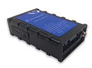

# Totemtech - AT05

The Totemtech AT05 is a compact GPS tracker designed for versatile asset and vehicle monitoring. It combines location reporting with movement status monitoring via a 3 axis digital accelerometer, supports real time tracking and history trace review, and provides a range of alarm types to notify users of events such as overspeed, low power, SOS, and power cut. The device also supports firmware upgrades over the air and accepts a wide range of power inputs with over voltage protection, making it suitable for varied deployments.

As a Plaspy compatible model, the AT05 can stream its tracking data into fleet management platforms to provide operational visibility and reporting. Its ability to send data to two servers simultaneously adds redundancy for integrations, while configurable I O ports and multiple alarm types make the AT05 flexible for different monitoring workflows inside Plaspy. These features make it a useful option for organizations wanting both live location and historical playback within a centralized fleet platform.

## Key Highlights

- Simultaneous data transmission to two servers for redundancy and parallel integrations
- 3 axis digital accelerometer for movement status and activity detection
- Firmware upgrade capability over the air to keep devices updated remotely
- Wide DC power input range with over voltage protection for varied vehicle and equipment environments
- Support for remote commands via GPRS and SMS for flexible device control
- Real time tracking plus history data traces for operational oversight and investigations
- Multiple alarm types and user defined I O settings for customizable alerts and event handling

## How It Works with Plaspy

The AT05 feeds positional and event data into Plaspy where it can be visualized, alerted on, and included in reports. Plaspy consumes the tracker stream to provide a consolidated view of assets, enable historical trace analysis, and trigger notifications when configured conditions occur.

- Live location plotted on Plaspy maps for continuous fleet visibility
- Historical route replay and event timelines for post trip review and auditing
- Alarm integration so overspeed, SOS, power loss, and other alerts appear as notifications in Plaspy
- Use of dual server output to send primary data to Plaspy while retaining a secondary data endpoint for backup or parallel services
- Mapping of user defined I O events into Plaspy workflows for custom alerts and status reporting

## Typical Use Cases

- Vehicle fleet monitoring for delivery, service, or transport operations
- Tracking construction or rental equipment across sites
- Monitoring high value assets that require both live location and event notifications
- Remote site equipment oversight where power variability and protection are important
- Situations requiring history traces for route verification and incident review

## Why Choose This Tracker with Plaspy

The AT05 is a practical choice for organizations that need a balance of real time visibility, event-driven alerts, and configurability. Its movement monitoring via an accelerometer and broad alarm support help surface actionable events, while OTA firmware updates reduce maintenance overhead for dispersed deployments. Combined with Plaspy, these capabilities support common fleet and asset management needs such as location monitoring, alerting, and historical analysis.

Given the model feature set, the AT05 is particularly well suited to deployments where redundancy and remote management matter. If your operation requires mapping live telemetry into a centralized platform for reporting and operational oversight, the AT05 paired with Plaspy provides a straightforward integration path.

To learn more about how Plaspy can work with Totemtech devices, visit https://www.plaspy.com. Product specifications and availability can change over time, so please verify current technical details and support information with the manufacturer at http://www.totemtek.com/ .
